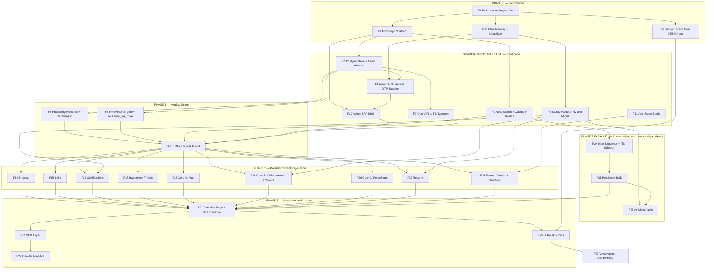

# Dependency Map — Audience-Segmented Portfolio Platform

**Document 2 of 3** · Companion documents: `tech-stack-analysis.md`, `development-plan.md`
**Status:** Draft for approval

---

## 1. Purpose

You asked for a build structured so most features can proceed independently and in parallel. That is achievable here — but only after a specific set of foundations exists, and only if three cross-cutting concerns are built *into* the spine rather than bolted on afterwards.

This document identifies what blocks what, what the true critical path is, and where the genuine parallelization opportunities lie. It is the input to phase sequencing in `development-plan.md`.

---

## 2. Feature Register

Every feature carries a stable ID used throughout all three documents.

### Foundations
| ID | Feature |
|---|---|
| F0 | Toolchain & agent environment (Codegraph, superpowers, react-doctor, agent configs, Stitch MCP) |
| F1 | Monorepo scaffold — pnpm workspaces, shared types package |
| F8 | Design tokens — Stitch `DESIGN.md` → Tailwind config |
| F30 | Infrastructure — Railway services, Cloudflare CDN/Tunnel/Access, domain, DNS |

### Shared Infrastructure
| ID | Feature |
|---|---|
| F2 | Postgres base schema + async Alembic |
| F3 | StorageAdapter (R2 / MinIO / local) |
| F4 | Admin auth — Access JWT verify + password + OTP + session |
| F7 | OpenAPI → TypeScript type generation |
| F9 | Next.js app shell — root layout, category cookie, SSR baseline |
| F10 | Admin SPA shell — routing, auth guard, layout |
| F12 | Anti-spam — Turnstile, honeypot, rate limiting |

### Cross-Cutting (built into the spine)
| ID | Feature |
|---|---|
| F5 | Publishing workflow — draft/published/scheduled, revalidation webhook, cron |
| F6 | Relevance engine — topic tags, `audience_tag_map`, per-item override |

### Content
| ID | Feature |
|---|---|
| F13 | **Timeline** (Education + Experience) — the spine |
| F14 | Projects (+ Experience cross-link) |
| F15 | Skills |
| F16 | Certifications |
| F17 | Investment Thesis |
| F18 | Core A — `Post` (rabbithole / how-I-use-AI / VC-for-founders) |
| F19 | Core B — `CollectionItem` (books, anime/manhwa) + cover fetch |
| F20 | Core C — `ProsePage` (hobbies, work views, investor intro) |
| F22 | Resume (two audience-mapped variants) |
| F23 | Forms — contact + dealflow, unified `FormSubmission` |

### Presentation
| ID | Feature |
|---|---|
| F24 | Intro sequence + tile-grid selector |
| F25 | Persistent HUD — compact selector, scroll indicator, audio control |
| F26 | Ambient audio player |
| F21 | Overview page + `OverviewIntro` |
| F11 | SEO layer — JSON-LD, sitemap, robots, canonical, `?for=` |
| F27 | Crawler analytics |
| F28 | UI re-skin pass |
| F29 | Voice agent — **deferred, design only** |

---

## 3. Dependency Graph



### Legend

| Notation | Meaning |
|---|---|
| `A --> B` | B cannot start until A is complete |
| Subgraph grouping | Features that ship together as a phase |
| **Bold node (F13)** | The spine — proves the pattern every downstream feature replicates |
| Dashed intent (F29) | Deferred; design-only in this plan |

---

## 4. Foundation Layer

Features with no upstream dependencies. These start first and everything waits on them.

| ID | Why it's foundational |
|---|---|
| **F0** | Nothing else is authored until the agent environment, skills, and Stitch MCP exist. Technically it blocks nothing; practically it determines how every later task is executed |
| **F30** | The Cloudflare Access single-hostname decision (`tech-stack-analysis.md` §6.2) must be made at infrastructure setup. Discovering it during admin integration means re-architecting deployment |

F1, F8 follow immediately from F0 and complete the foundation.

---

## 5. Critical Path

The longest chain of strictly sequential work. Nothing shortens the project below this.

```
F0  Toolchain & agent environment
 └─ F1  Monorepo scaffold
     └─ F2  Postgres base + async Alembic
         └─ F4  Admin auth
             └─ F10 Admin SPA shell
                 └─ F13 TIMELINE SPINE  ◄── includes F5 + F6
                     └─ F14 Projects     ◄── only content feature with a hard dependency on F13's data
                         └─ F21 Overview page
                             └─ F11 SEO layer
                                 └─ F28 UI re-skin
                                     └─ LAUNCH
```

**Three observations that matter for scheduling:**

**F13 is the widest bottleneck in the project.** Nine content features wait on it. That is the deliberate cost of the spine-first approach you chose — and choosing Timeline, the most complex tag logic, maximises both the cost and the benefit. Every hour spent getting F13's patterns right saves nine repetitions of a mistake.

**F14 is the only content feature genuinely on the critical path.** Projects carries a foreign key to Experience for the timeline cross-link, so it cannot begin until F13's schema is settled. Every other content feature (F15–F23) is off the critical path and slots into available capacity.

**F21 is the convergence point and the highest-risk item in the plan.** It depends on ten upstream features. If built as a single task at the end, it becomes a big-bang integration where every content model's assumptions get tested simultaneously. Mitigation in §8.

---

## 6. Parallelization Opportunities

After F13 completes, work splits into six independent tracks. Tracks share no files and no schema, so they can proceed in any order and any combination.

| Track | Features | Blocked by | Notes |
|---|---|---|---|
| **A** | F14 Projects | F13, F3 | Critical path. Start first. Heaviest content feature — media, cross-links, relevance |
| **B** | F15 Skills, F16 Certifications | F13, F3 (F16 only) | F15 has no relevance logic (shows everything) — the simplest content feature in the project |
| **C** | F17 Thesis, F18 Post | F13 | Both are near-pure CRUD. F18 feeds three public pages from one model — highest leverage per hour |
| **D** | F19 CollectionItem, F20 ProsePage | F13, F3 (F19 only) | F19 carries the only third-party integration risk in Phase 2 (Open Library / Jikan) |
| **E** | F22 Resume, F23 Forms | F13, F3, F12 (F23) | F23 is the only feature with an outbound side effect (Resend) |
| **F** | F24 Intro, F25 HUD, F26 Audio | F9 only | **Can start during F13** — see below |

### Track F starts early

Track F is the significant scheduling insight. The intro sequence, tile selector, HUD and audio player have **no dependency on any content model** — they are pure presentation over the app shell (F9). F9 lands during shared-infrastructure work, well before the spine completes.

So Track F runs concurrently with F13 rather than after it. Given that F24 and F25 carry the most novel animation work in the project (six-word accumulation, square-to-grid morph, HUD collapse), starting them early de-risks the least predictable work while the backend spine is still being built.

**Internal ordering within Track F is strict:** F24 → F25 → F26. The HUD's compact selector is the collapsed state of F24's grid — same component, same shared layout animation. The audio control lives inside the HUD, so F26 waits on F25.

### What cannot be parallelized

- **F5 and F6 must be inside F13, not after it.** Publishing states and relevance tagging are cross-cutting concerns touching every content model. If Timeline ships without them, retrofitting draft/scheduled states and tag-based highlighting across nine models is nine times the work and nine chances to do it inconsistently. This is the single most important sequencing constraint in the document.
- **F7 (typegen) must exist before the first frontend consumes the first endpoint.** Introducing generated types after hand-written ones exist means reconciling two sources of truth.
- **F28 (re-skin) is genuinely last.** It depends on every visual surface existing. This is what makes your "UI at the end" preference work — but only because F8 puts design tokens in place early, so the re-skin is a token swap plus layout passes rather than a rewrite.

---

## 7. Shared Infrastructure

Built once, consumed everywhere. Getting these wrong is expensive because the cost is multiplied across every downstream feature.

| ID | Consumed by | Consequence of building it late or badly |
|---|---|---|
| **F2** Postgres base + async Alembic | All content | Alembic's default `env.py` is synchronous and fails quietly against an async engine. Every subsequent migration inherits the defect |
| **F3** StorageAdapter | F16, F19, F22, F26, F21 | Direct boto3 calls scattered across features make the R2/MinIO/local swap a refactor instead of a config change |
| **F4** Admin auth | All admin screens | Cloudflare Access issues no application session. Discovering this after building admin CRUD means retrofitting auth through every screen |
| **F5** Publishing workflow | All content | See §6 — the highest-cost retrofit in the project |
| **F6** Relevance engine | F13, F14, F21, F22 | The `audience_tag_map` table plus per-item override is the mechanism behind highlight/dim, tile visibility, and resume selection. Three features, one mechanism |
| **F7** Typegen | All frontend | Contract drift is silent until runtime |
| **F9** Next.js shell | All public pages | The category cookie must be readable server-side (`tech-stack-analysis.md` A6). Getting this wrong reintroduces the SEO problem |
| **F12** Anti-spam | F23 | Both forms share one submission endpoint; the anti-spam stack is written once |

**One shared concern is easy to miss:** the **overlay-not-replacement** rule for F24. The intro and selector must render above content that is already in the server HTML. It belongs to F9's shell architecture, not to F24's animation work — if F9 establishes the wrong composition pattern, F24 will faithfully implement an SEO regression.

---

## 8. Risk: The F21 Convergence

F21 (Overview) depends on ten features. Built as a single end-loaded task, it fails predictably: every content model's tile contract gets validated at once, on the critical path, immediately before launch.

**Mitigation — build F21 incrementally.** Establish the tile grid, `OverviewIntro`, and the tile contract *during the spine* (F13), rendering exactly one tile type: the Timeline summary. Each subsequent content feature then adds its own tile as the final sub-task of its own track. F21's remaining scope at Phase 3 shrinks to per-audience tile arrangement and the empty-state rules — a day's work rather than an integration crisis.

This changes the graph in practice: F21's dependencies become *soft* (each content feature contributes its tile) rather than *hard* (F21 waits for all of them). The Mermaid diagram shows the hard-dependency worst case; the plan will implement the incremental version.

---

## 9. Phase Sequencing Implication

Derived directly from the above, for `development-plan.md`:

| Phase | Contents | Parallelism |
|---|---|---|
| **P0** | F0, F30, F1, F8 | Low — sequential setup |
| **P1** | F2, F3, F4, F7, F9, F10, F12 → then F13 (with F5, F6) | Medium — infra parallel, spine sequential |
| **P2** | Tracks A–E, plus Track F running from early P1 | **High — six concurrent tracks** |
| **P3** | F21 completion, F11, F27, F28 | Low — integration and polish |
| **P4** | F29 voice agent | Deferred, design only |

The parallelism you asked for is real, and it lives in P2. The price of getting it is a disciplined P1 — the spine has to be right, because nine features copy it.
