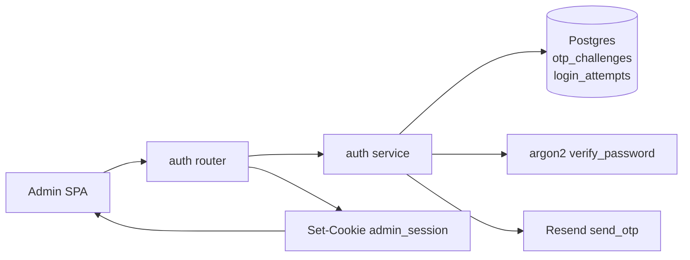
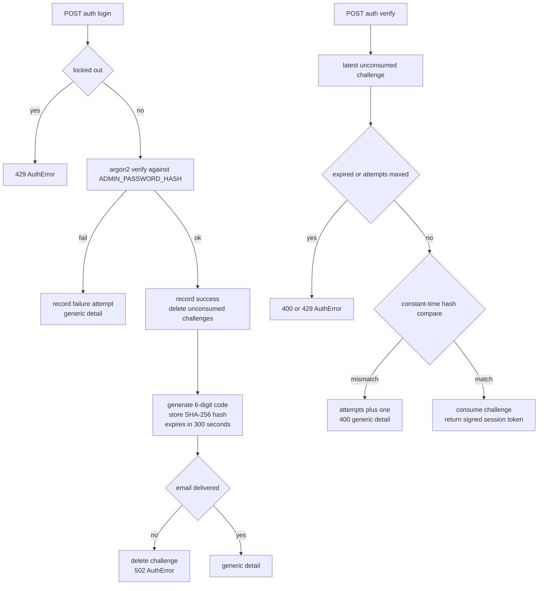

# Auth — password + email OTP sign-in for the single admin

## Purpose

Authenticates the one administrator behind the admin SPA. Every `/api/v1/admin/*`
router is gated by `admin_auth()`, so this feature is the entry point for all admin
editing of portfolio content. Login is two-step: the password proves identity and
triggers a 6-digit OTP emailed via Resend; verifying the code sets a signed session
cookie.

## API Surface

| Method | Path | Auth | Request -> Response | Notes |
| --- | --- | --- | --- | --- |
| POST | /api/v1/auth/login | Public, 5/min per IP | LoginRequest `{password}` -> `{detail}` | Identical generic detail on success and failure |
| POST | /api/v1/auth/verify | Public, 10/min per IP | VerifyRequest `{code}` -> `{status: ok}` | Sets `admin_session` cookie on success |
| POST | /api/v1/auth/logout | Public | none -> `{status: ok}` | Clears cookie only; no DB work |
| GET | /api/v1/admin/me | Session cookie + Cloudflare Access | none -> `{status: ok}` | Probe that the admin gate accepts the caller |

## Data Flow

Auth has no repository layer; the service issues SQLAlchemy statements directly.
`AuthError` carries a status code and detail and is converted to a JSON response by
the exception handler registered in `app/app.py`.

## Functionality

## Files To Reference

- backend/app/features/auth/endpoints/router.py — routes and slowapi limiters
- backend/app/features/auth/service.py — request_otp, verify_otp, is_locked_out
- backend/app/features/auth/models.py — OtpChallenge, LoginAttempt, OTP constants
- backend/app/features/auth/schemas.py — LoginRequest, VerifyRequest
- backend/app/features/auth/utils.py — client_ip
- backend/app/core/session.py — cookie name, itsdangerous signing, 8h max age
- backend/app/core/security.py — argon2 verification with timing decoy
- backend/app/core/email.py — Resend delivery of the code
- backend/app/core/deps.py — require_admin, admin_auth
- backend/app/app.py — AuthError and RateLimitExceeded handlers

## Invariants

- Wrong password and correct password are indistinguishable: same generic detail,
  same HTTP 200, and every path pays the Argon2 cost (a timing decoy hash is verified
  when no admin hash is configured).
- OTP codes are never persisted, logged, or echoed; only their SHA-256 hex hash is
  stored (`code_hash`), compared with `hmac.compare_digest`.
- A successful login deletes all unconsumed challenges, so only the latest
  outstanding challenge can ever be verified.
- Lockout is DB-backed per IP: at least 10 failures inside the 15-minute window
  since the last success; a success resets the counting window.
- Per-challenge limits: 5 attempts, 300-second TTL, single use via `consumed_at`.
- Session tokens are itsdangerous-signed payloads (not JWTs); the cookie is HttpOnly,
  Secure with SameSite=strict in production, Lax otherwise, max age 8 hours.
- Admin routers depend on `require_admin` plus `verify_cf_access`; rate limiting runs
  before handlers via slowapi keyed on remote address.
