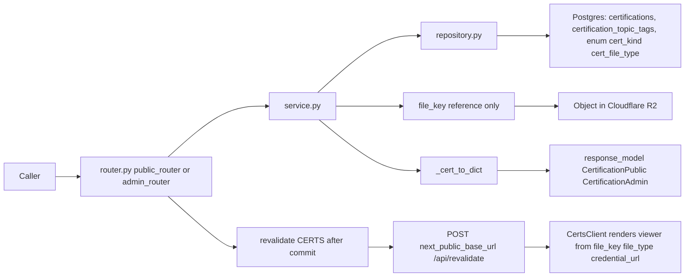
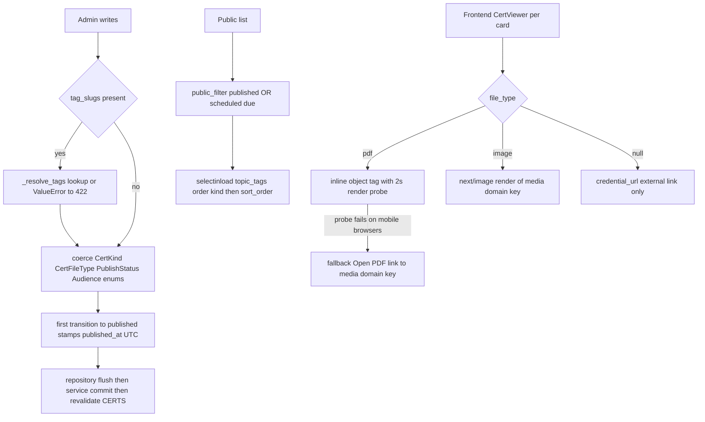

# Certifications — Issued credentials with kind split and R2-backed files

## Purpose

CRUD for the `certifications` content type: technical/business certifications with
issuer, issue/expiry dates, an external credential URL, and an optional credential
file (pdf or image) stored in R2 and referenced by `file_key`. Public reads expose
only published rows; the frontend groups them by `kind`.

## API Surface

| Method | Path | Auth | Request -> Response | Notes |
| --- | --- | --- | --- | --- |
| GET | `/api/v1/certifications` | none | -> `CertificationPublic[]` | Applies `public_filter`; ordered by `kind`, then `sort_order` |
| GET | `/api/v1/certifications/{cert_id}` | none | -> `CertificationPublic` | 404 if absent or not public |
| GET | `/api/v1/admin/certifications` | admin_auth | -> `CertificationAdmin[]` | Bypasses publish filter |
| GET | `/api/v1/admin/certifications/{cert_id}` | admin_auth | -> `CertificationAdmin` | 404 if absent |
| POST | `/api/v1/admin/certifications` | admin_auth | `CertificationCreate` -> 201 `CertificationAdmin` | Unknown `tag_slugs`, bad `kind`/`file_type` -> 422 |
| PATCH | `/api/v1/admin/certifications/{cert_id}` | admin_auth | `CertificationUpdate` -> `CertificationAdmin` | Partial update; same 422 contract |
| DELETE | `/api/v1/admin/certifications/{cert_id}` | admin_auth | -> 204 | Missing id -> 404 |

`admin_auth` = signed session cookie plus Cloudflare Access verification
(`core/deps.py`). There is no upload endpoint: `file_key` is written via CRUD and
the object itself lives in R2 (uploaded out of band or by other tooling).

## Data Flow

## Functionality

The mobile PDF fallback contract: inline `<object type="application/pdf">` is probed;
if the document body stays empty for 2s (typical on mobile browsers that cannot embed
PDF), the card swaps to a plain "Open PDF" anchor over `${R2_DOMAIN}/${file_key}`.
Backend responsibility is limited to serving truthful `file_key` + `file_type` values.

## Files To Reference

- backend/app/features/certifications/models.py — `Certification`, `CertKind`, `CertFileType`, `certification_topic_tags`
- backend/app/features/certifications/schemas.py — `CertificationPublic/Admin/Create/Update`
- backend/app/features/certifications/repository.py — `public_filter` usage, kind ordering
- backend/app/features/certifications/service.py — enum coercion, tag resolution, publish stamping
- backend/app/features/certifications/endpoints/router.py — route table, revalidation calls
- backend/app/core/models.py — `PublishableMixin`
- frontend/components/certifications/CertViewer.tsx — inline-PDF probe and fallback

## Invariants

- Service returns dicts; schemas have no `from_attributes=True` (MissingGreenlet guard).
- Repository imports no FastAPI; public reads use only `core.queries.public_filter`.
- `kind` is a closed native enum: `technical` or `business`; `file_type`: `pdf` or `image`.
- Unknown `tag_slugs` -> 422 with sorted missing slugs listed; delete of unknown id -> 404.
- `revalidate([CERTS])` fires after commit, never inside the transaction, never raises;
  literal `"certifications"` must match `frontend/lib/cacheTags.ts`.
- Rows are UUID-keyed with unique-indexed publish lifecycle columns from `PublishableMixin`.
