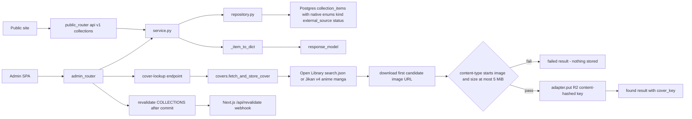
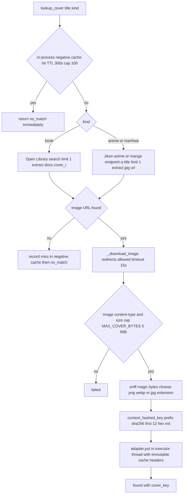

# Collections — Books, anime, and manhwa with a download-once R2 cover pipeline

## Purpose

CRUD for the `collection_items` content type: personal reading/watching tracking
for three kinds (`book`, `anime`, `manhwa`). Personal-audience feature by design:
no topic tags and no audience override exist anywhere in model or schemas. Covers
are looked up from external catalogs once, validated, stored in R2 under
content-hashed keys, and only ever rendered from R2 URLs — third-party hosts are
never hotlinked.

## API Surface

| Method | Path | Auth | Request -> Response | Notes |
| --- | --- | --- | --- | --- |
| GET | `/api/v1/collections` | none | -> `CollectionItemPublic[]` | `public_filter` applied; ordered kind, section, sort_order |
| GET | `/api/v1/admin/collections` | admin_auth | -> `CollectionItemAdmin[]` | Adds publish status fields |
| GET | `/api/v1/admin/collections/{item_id}` | admin_auth | -> `CollectionItemAdmin` | 404 if absent |
| POST | `/api/v1/admin/collections` | admin_auth | `CollectionItemCreate` -> 201 | Reading state sent as `status`, publish state as `publish_status` |
| PATCH | `/api/v1/admin/collections/{item_id}` | admin_auth | `CollectionItemUpdate` -> `CollectionItemAdmin` | Partial; first publish stamps `published_at` |
| DELETE | `/api/v1/admin/collections/{item_id}` | admin_auth | -> 204 | Missing id -> 404 |
| POST | `/api/v1/admin/collections/cover-lookup` | admin_auth | `CoverLookupRequest` -> `CoverLookupResponse` | `{status: found/no_match/failed, cover_key?}`; no DB writes |

All mutating paths call `revalidate([COLLECTIONS])` after commit.

## Data Flow

## Functionality

The model column is named `status_` because `PublishableMixin.status` already owns
the draft/scheduled/published lifecycle; the service maps reading state
(`reading`/`completed`/`want_to_read`) to schema field `status` and publish state
to schema field `status_`.

## Files To Reference

- backend/app/features/collections/models.py — `CollectionItem`, `CollectionKind`, `CollectionStatus`, `ExternalSource`
- backend/app/features/collections/covers.py — lookup, validation, negative cache, R2 write
- backend/app/features/collections/service.py — dict conversion, `status_` mapping, `lookup_cover`
- backend/app/features/collections/repository.py — public vs admin ordering, plain CRUD
- backend/app/features/collections/endpoints/router.py — route table incl. `/cover-lookup`
- backend/app/core/storage.py — `StorageAdapter`, `content_hashed_key`, R2/MinIO/local impls

## Invariants

- No topic tags, no audience override: this content never enters the relevance system.
- Download once, store in R2, never hotlink Open Library/Jikan image URLs at render.
- Validate before store: non-`image/*` content types and bodies over 5 MiB are
  rejected loudly — an HTML error page must never be persisted as a cover.
- Keys are `<prefix>-<sha256[:12]>.<ext>`: changed bytes change the URL, so edge
  caches serving immutable objects can never go stale.
- Negative-cache misses are best-effort in-process state (300s TTL), not shared cache.
- `revalidate([COLLECTIONS])` runs strictly after commit; literal must match
  `frontend/lib/cacheTags.ts`.
