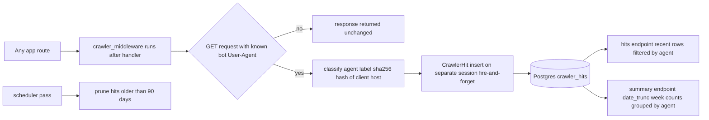
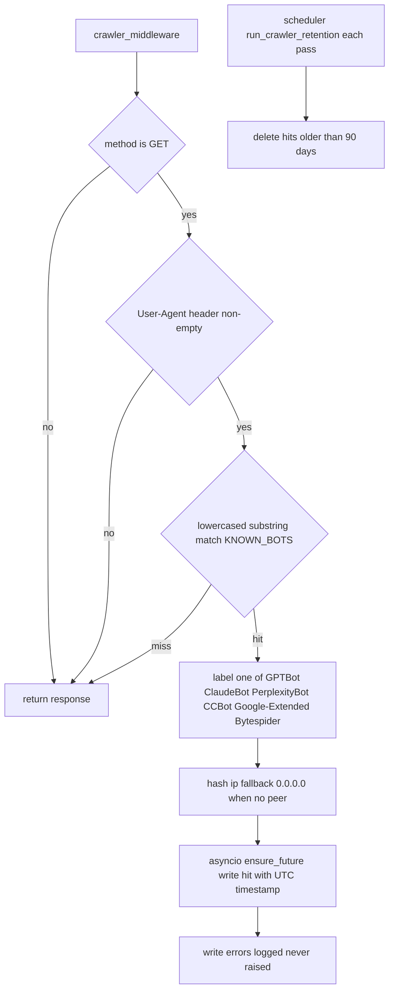

# Crawlers — AI-crawler hit analytics without storing IP addresses

## Purpose

Records which known AI crawlers read which paths, for admin visibility into
AI training and answer-engine traffic. A global FastAPI middleware classifies
the User-Agent after each response, hashes the client address with SHA-256,
and writes a `crawler_hits` row on a side session so logging can never slow
down or fail a request. The admin panel queries recent hits and weekly
per-agent counts.

## API Surface

| Method | Path | Auth | Request -> Response | Notes |
| --- | --- | --- | --- | --- |
| GET | /api/v1/admin/crawlers/hits | Admin cookie | Query agent_label, limit 1 to 500 default 100 -> CrawlerHitOut list | Newest first; optional per-agent filter |
| GET | /api/v1/admin/crawlers/summary | Admin cookie | none -> CrawlerSummaryRow agent_label week_start count | Weekly buckets, week_start descending |

CrawlerHitOut fields: id, user_agent, path, ip_hash, agent_label, timestamp.
There is no public endpoint — crawler data is admin-only.

## Data Flow

The middleware is registered globally via `app.middleware("http")` in
app/app.py, so it observes every route including admin ones. Writes use
`asyncio.ensure_future` against the shared async_session_factory; failures
are logged with a stack trace and otherwise invisible to callers.

## Functionality

Classification maps substrings: `claude` and `anthropic` also label as
ClaudeBot. Caveats worth knowing before trusting the numbers:

- Retention prunes rows older than 90 days on every scheduler pass, so hits
  and summary silently lose history beyond that window.
- Undercount by origin: the hash input is `request.client.host`, the direct
  connection peer. Behind Cloudflare or another proxy every crawler arrives
  from proxy origin IPs, so distinct crawlers can collapse into identical
  ip_hash values and per-crawler uniqueness cannot be derived from them.

## Files To Reference

- backend/app/features/crawlers/middleware.py — KNOWN_BOTS map, _classify_agent, _hash_ip, _write_hit
- backend/app/features/crawlers/models.py — CrawlerHit columns and indexes
- backend/app/features/crawlers/repository.py — create, list_recent, count_by_agent_weekly, delete_older_than
- backend/app/features/crawlers/schemas.py — CrawlerHitOut, CrawlerSummaryRow
- backend/app/features/crawlers/endpoints/router.py — admin hits and summary routes
- backend/app/app.py — global registration of crawler_middleware
- backend/app/jobs/scheduler.py — run_crawler_retention defaulting to 90 days

## Invariants

- Raw IP addresses are never stored — only the 64-character SHA-256 hex of
  the client host.
- Non-GET requests, empty User-Agents, and unknown bots never touch the
  table; only the six labeled agents are recorded.
- Logging is strictly fire-and-forget: the write runs on its own session in
  a background task, and any exception is logged without propagating.
- crawler_hits indexes timestamp and agent_label, backing both the recent
  hits listing and the weekly summary group-by.
- agent_label is nullable at the schema level, though middleware always sets
  it on write; summary groups nulls as their own row if any ever exist.
