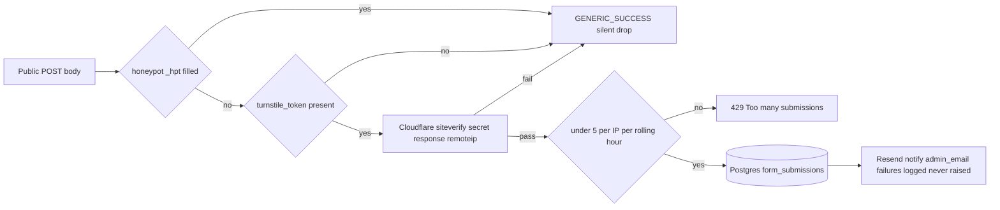
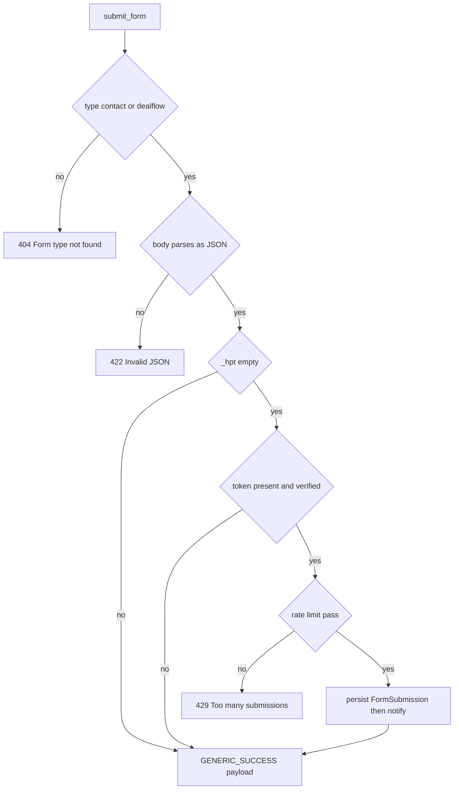

# Forms — public contact and dealflow intake behind layered anti-abuse

## Purpose

Accepts visitor submissions from two public forms, `contact` and `dealflow`,
into one shared `form_submissions` table. Before anything is written, each
submission passes a honeypot check, Cloudflare Turnstile verification, and a
per-IP rate limit. Screened-out bots receive exactly what successful humans
receive. An authenticated admin inbox supports listing, marking read, and CSV
export; marking read triggers a cache revalidation.

## API Surface

| Method | Path | Auth | Request -> Response | Notes |
| --- | --- | --- | --- | --- |
| POST | /api/v1/forms/contact or dealflow | Public | Raw JSON body -> GENERIC_SUCCESS message dict | Unknown type 404; malformed JSON 422; over-limit 429 |
| GET | /api/v1/admin/forms | Admin cookie | Query form_type, is_read -> FormSubmissionAdmin list | Newest first; both filters optional |
| GET | /api/v1/admin/forms/{submission_id} | Admin cookie | none -> FormSubmissionAdmin | 404 when missing |
| PATCH | /api/v1/admin/forms/{submission_id} | Admin cookie | FormSubmissionUpdate with is_read -> FormSubmissionAdmin | Fires revalidate of tag forms |
| GET | /api/v1/admin/forms/export/csv | Admin cookie | Optional form_type -> text/csv | Attachment named submissions.csv |

## Data Flow

The rate limit is a SQL COUNT on the same table filtered by `ip_address` and
`created_at` within the last hour — no separate counter store. Notification
runs after commit via `email.send_email`; its failures are caught, logged at
ERROR, and never affect the response. Admin PATCH calls `revalidate([FORMS])`
after commit, posting the tag to the Next.js `/api/revalidate` webhook.

## Functionality

Every screened path returns the identical GENERIC_SUCCESS constant defined in
the router, so a bot cannot distinguish honeypot capture from a rejected
Turnstile token from success. Stored payload JSONB excludes `_hpt`,
`turnstile_token`, `consent_given`, `consent_text`, and `email`; the last
three become dedicated columns instead. `verify_turnstile` rejects when
TURNSTILE_SECRET_KEY is missing, the HTTP request fails, or Cloudflare reports
success false — all indistinguishable. CSV export columns: id, form_type,
submitter_email, consent_given, consent_text, is_read, ip_address, user_agent,
created_at, payload.

## Files To Reference

- backend/app/features/forms/endpoints/router.py — anti-abuse chain, GENERIC_SUCCESS, rate-limit SQL, admin routes
- backend/app/features/forms/service.py — submit_dict, Resend _notify, csv_export
- backend/app/features/forms/repository.py — create, get, list_all_admin, update queries
- backend/app/features/forms/models.py — FormType enum, FormSubmission columns
- backend/app/features/forms/schemas.py — FormSubmissionAdmin, FormSubmissionUpdate
- backend/app/core/turnstile.py — verify_turnstile against Cloudflare siteverify
- backend/app/features/auth/utils.py — client_ip used for remoteip and rate limiting
- backend/app/core/email.py — send_email delivery through Resend
- backend/app/core/revalidation.py and core/cache_tags.py — post-commit FORMS tag revalidation

## Invariants

- Honeypot hits, missing tokens, failed verifications, and real submissions
  all return the identical GENERIC_SUCCESS payload; only 404, 422, and 429
  responses ever differ from it.
- Check order is fixed: honeypot first, then Turnstile, then rate limit,
  then the database write — cheapest signals run before any persistence.
- Raw request keys `_hpt`, `turnstile_token`, `consent_given`,
  `consent_text`, and `email` never enter payload; email gets its own column
  and both consent fields are snapshotted verbatim.
- Rate limiting counts committed rows: at most 5 submissions per client IP
  in any rolling one-hour window, enforced with a 429.
- Email notification failure only logs; the submission is already committed
  and the caller already has success, so delivery can never block intake.
- The model stores submitter IP in plaintext String(45) for rate limiting
  and admin display — unlike crawlers, this feature is not IP-hashed.
- Admin state changes revalidate tag `forms` after commit; that literal must
  stay in sync with frontend/lib/cacheTags.ts or revalidation silently no-ops.
