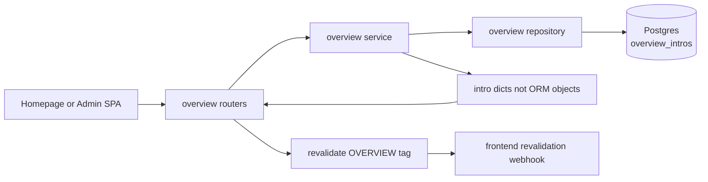
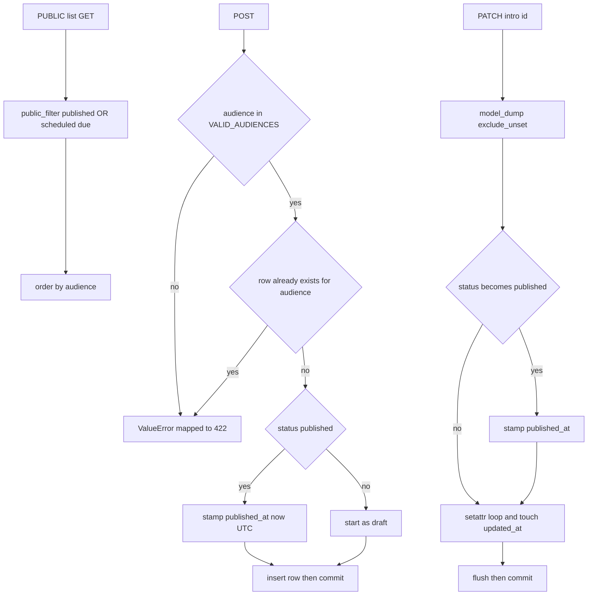

# Overview — per-audience homepage intro rows

## Purpose

Stores exactly one introduction row per audience segment plus a `default` row for
crawlers and first-time visitors: headline, body, hero image key, and CTA. The
homepage fetches all rows (or a single row by audience) and picks the variant for
the active audience tile; the admin SPA edits rows through full CRUD.

## API Surface

| Method | Path | Auth | Request -> Response | Notes |
| --- | --- | --- | --- | --- |
| GET | /api/v1/overview | Public | none -> list[OverviewIntroPublic] | public_filter applied, ordered by audience |
| GET | /api/v1/overview/{audience} | Public | none -> OverviewIntroPublic | Lookup by audience string has no status filter; 404 if absent |
| GET | /api/v1/admin/overview | Admin | none -> list[OverviewIntroAdmin] | All statuses, ordered by audience |
| GET | /api/v1/admin/overview/{intro_id} | Admin | none -> OverviewIntroAdmin | Adds status, publish_at, published_at |
| POST | /api/v1/admin/overview | Admin | OverviewIntroCreate -> OverviewIntroAdmin 201 | Rejects invalid or duplicate audience with 422 |
| PATCH | /api/v1/admin/overview/{intro_id} | Admin | OverviewIntroUpdate -> OverviewIntroAdmin | Partial update |
| DELETE | /api/v1/admin/overview/{intro_id} | Admin | none -> 204 | |

## Data Flow

Hero images live outside this flow: `hero_image_key` stores an object key served
from R2-backed storage; the feature itself performs no storage calls.

## Functionality

## Files To Reference

- backend/app/features/overview/endpoints/router.py — both routers, revalidate calls
- backend/app/features/overview/service.py — uniqueness guard, publish transition, _intro_to_dict
- backend/app/features/overview/repository.py — list_public, get_by_audience, get_by_id, CRUD
- backend/app/features/overview/models.py — OverviewIntro, VALID_AUDIENCES
- backend/app/features/overview/schemas.py — public/admin/create/update shapes
- backend/app/core/queries.py — public_filter definition
- backend/app/core/models.py — PublishableMixin
- backend/app/core/cache_tags.py — OVERVIEW literal

## Invariants

- `audience` is a plain String(50) column, not the native Postgres audience enum,
  because the `default` sentinel must never enter the database enum (conventions
  invariant 3).
- One row per audience: enforced by a unique index on `audience` plus an explicit
  pre-insert existence check in the service.
- VALID_AUDIENCES is the closed set: default, recruiters, techies, investors,
  founders, personal. The Audience enum excludes `default`.
- Services return plain dicts, never ORM objects, avoiding MissingGreenlet after
  flush; routers rebuild Pydantic models from those dicts.
- The public LIST applies public_filter (published or scheduled due); the public
  by-audience lookup does not apply it.
- `published_at` is stamped only when an entry transitions into published status;
  updates set `updated_at` locally before flush.
- Router calls `revalidate([OVERVIEW])` only after the service commits successfully;
  revalidation failures never fail the request.
