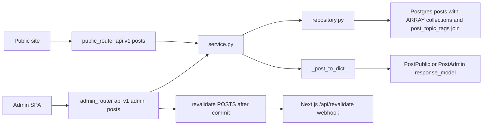
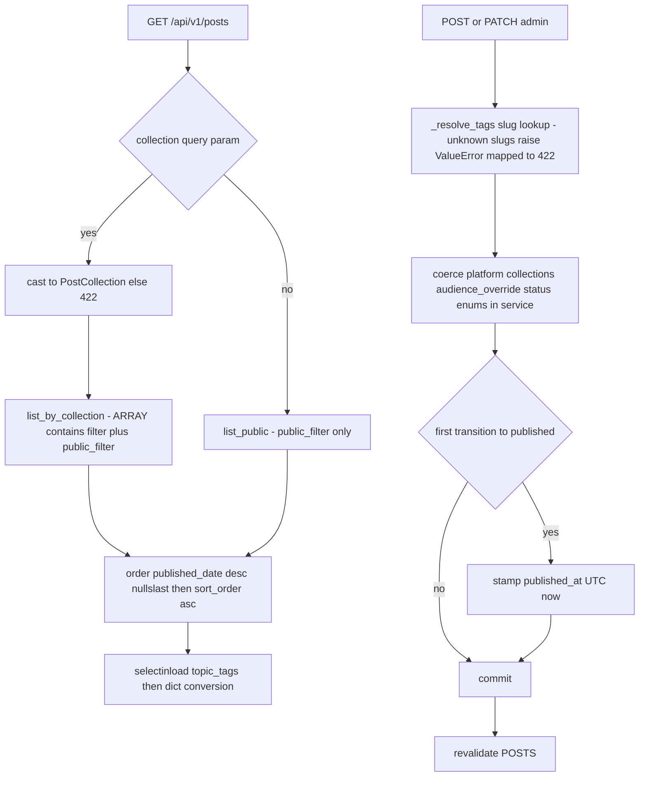

# Posts — External writing links routed to themed pages by collection

## Purpose

CRUD for the `posts` content type: outbound links to writing and talks (Substack,
Medium, YouTube, other). A post carries two deliberately separate metadata axes:

- `collections` — Postgres `ARRAY(post_collection)` whose values map 1:1 to themed
  page routes (`tech_rabbithole`, `how_i_use_ai`, `vc_for_founders`). Routing concern.
- `topic_tags` — many-to-many to the shared `TopicTag` model via the
  `post_topic_tags` join table. Relevance/audience concern.

Collections are routing, not relevance: they decide which themed page a post
appears on, never how it is ranked or personalized.

## API Surface

| Method | Path | Auth | Request -> Response | Notes |
| --- | --- | --- | --- | --- |
| GET | `/api/v1/posts` | none | -> `PostPublic[]` | Optional `?collection=` filters via ARRAY contains; unknown value -> 422 |
| GET | `/api/v1/posts/{post_id}` | none | -> `PostPublic` | 404 if absent |
| GET | `/api/v1/admin/posts` | admin_auth | -> `PostAdmin[]` | Bypasses `public_filter`; adds status/publish fields |
| GET | `/api/v1/admin/posts/{post_id}` | admin_auth | -> `PostAdmin` | 404 if absent |
| POST | `/api/v1/admin/posts` | admin_auth | `PostCreate` -> 201 `PostAdmin` | Unknown `tag_slugs` -> 422 |
| PATCH | `/api/v1/admin/posts/{post_id}` | admin_auth | `PostUpdate` -> `PostAdmin` | Partial; first publish stamps `published_at` |
| DELETE | `/api/v1/admin/posts/{post_id}` | admin_auth | -> 204 | Missing id -> 404 |

All write paths call `revalidate([POSTS])` after commit.

## Data Flow

## Functionality

The three frontend routes (`frontend/app/tech-rabbithole`, `how-i-use-ai`,
`vc-for-founders`) each fetch `/posts?collection=<slug>` and share one list
component, `frontend/features/posts/PostList.tsx`. Adding a theme means adding an
enum member plus a page — no relevance logic involved.

## Files To Reference

- backend/app/features/posts/models.py — `Post`, `PostCollection`, `PostPlatform`, `post_topic_tags`
- backend/app/features/posts/schemas.py — `PostPublic/Admin/Create/Update`
- backend/app/features/posts/repository.py — public vs collection vs admin queries
- backend/app/features/posts/service.py — dict conversion, enum coercion, tag resolution
- backend/app/features/posts/endpoints/router.py — route table, revalidation calls
- backend/app/core/models.py — `PublishableMixin`, `TopicTag`
- backend/app/core/cache_tags.py and core/revalidation.py — `POSTS` tag plumbing

## Invariants

- `collections` (ARRAY) is for page routing; `topic_tags` (M2M) feeds audience
  relevance. Never merge them or query one through the other.
- Service returns plain dicts; schemas declare no `from_attributes` (MissingGreenlet).
- Public reads must go through `public_filter` from `core/queries.py`; admin bypasses explicitly.
- Enum coercion lives in the service layer; invalid values surface as 422.
- `published_at` is stamped only when transitioning into `PUBLISHED`, never overwritten later.
- `revalidate([POSTS])` runs strictly after commit and never raises; the `"posts"`
  literal must stay in sync with `frontend/lib/cacheTags.ts`.
