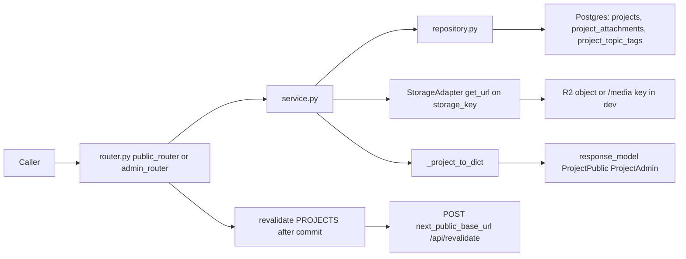
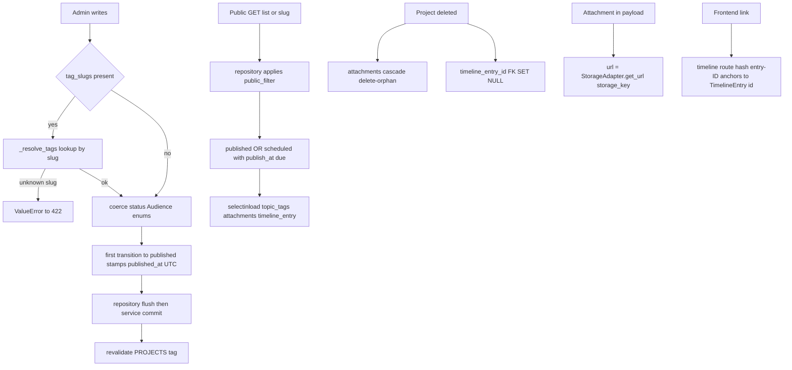

# Projects — Portfolio projects with file attachments and timeline cross-links

## Purpose

CRUD for the `projects` content type: publishable portfolio projects, each optionally
linked to a timeline entry and carrying typed file attachments (pdf/ppt/image) stored
in R2. Public site reads published rows only; the admin SPA manages everything.

## API Surface

| Method | Path | Auth | Request -> Response | Notes |
| --- | --- | --- | --- | --- |
| GET | `/api/v1/projects` | none | -> `ProjectPublic[]` | Applies `public_filter`; ordered by `sort_order`, then newest |
| GET | `/api/v1/projects/{slug}` | none | -> `ProjectPublic` | 404 if slug missing or not public |
| GET | `/api/v1/admin/projects` | admin_auth | -> `ProjectAdmin[]` | Bypasses publish filter |
| GET | `/api/v1/admin/projects/{project_id}` | admin_auth | -> `ProjectAdmin` | 404 if absent |
| POST | `/api/v1/admin/projects` | admin_auth | `ProjectCreate` -> 201 `ProjectAdmin` | Unknown `tag_slugs` -> 422 |
| PATCH | `/api/v1/admin/projects/{project_id}` | admin_auth | `ProjectUpdate` -> `ProjectAdmin` | Partial update; unknown tags -> 422 |
| DELETE | `/api/v1/admin/projects/{project_id}` | admin_auth | -> 204 | Missing id -> 404 |

`admin_auth` = signed session cookie (`require_admin`) plus Cloudflare Access
verification (`core/deps.py`). Attachments have no dedicated endpoints; they are
embedded read-only in every project payload with URLs resolved via `StorageAdapter`.

## Data Flow

## Functionality

The anchor contract: a project with `timeline_entry_id` renders a link to
`/timeline#entry-{id}` (frontend/features/projects/components/ProjectDetail.tsx);
`TimelineClient.tsx` clears tag filters, scrolls to element `entry-{id}`, and rings it.

## Files To Reference

- backend/app/features/projects/models.py — `Project`, `ProjectAttachment`, `ProjectAttachmentKind`, `project_topic_tags`
- backend/app/features/projects/schemas.py — `ProjectPublic/Admin/Create/Update`, `AttachmentRef`
- backend/app/features/projects/repository.py — queries only, `public_filter` usage
- backend/app/features/projects/service.py — dict conversion, enum coercion, tag resolution
- backend/app/features/projects/endpoints/router.py — route table, revalidation calls
- backend/app/core/models.py — `PublishableMixin` status/publish_at/published_at/is_pinned
- backend/app/core/storage.py — `get_url` for attachment URLs
- frontend/components/timeline/TimelineClient.tsx — `#entry-` hash handling

## Invariants

- Service returns dicts, never ORM objects; schemas set no `from_attributes=True`
  (MissingGreenlet guard). See service module docstrings.
- Repository imports no FastAPI; routers stay thin.
- Public reads go only through `core.queries.public_filter`; admin bypasses explicitly.
- `revalidate([PROJECTS])` fires after commit, never inside the transaction, and never raises.
- Tag literal `"projects"` must match `frontend/lib/cacheTags.ts` or revalidation silently no-ops.
- `timeline_entry_id` is `ON DELETE SET NULL`; attachments cascade with the project.
- Primary keys are UUIDs; `slug` is unique and indexed.
