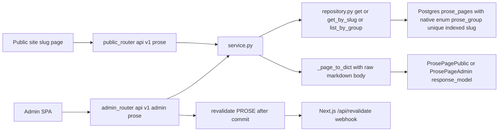
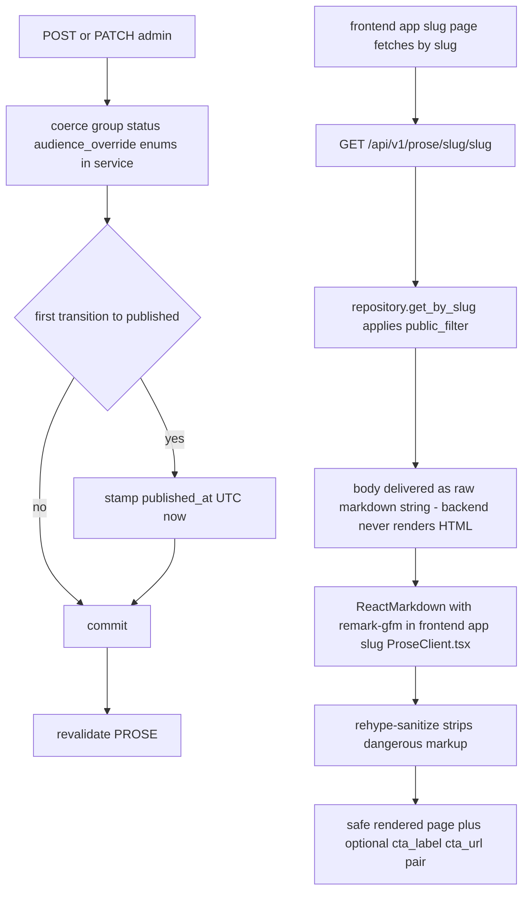

# Prose — Markdown pages organized by an explicit editorial group enum

## Purpose

CRUD for the `prose_pages` content type: standalone markdown documents (with
optional CTA) addressed by unique slug. Placement is editorial, not computed:
each page declares one `ProseGroup` (`hobbies`, `work_views`, `investor_intro`)
that routes it to a section of the site. There are no topic tags and no
relevance machinery on this model; audience override exists for admin-side
variant filtering but is omitted from the public schema.

## API Surface

| Method | Path | Auth | Request -> Response | Notes |
| --- | --- | --- | --- | --- |
| GET | `/api/v1/prose` | none | -> `ProsePagePublic[]` | `public_filter` applied; ordered group asc then sort_order asc |
| GET | `/api/v1/prose/slug/{slug}` | none | -> `ProsePagePublic` | Also applies `public_filter`, so drafts are unreachable by slug |
| GET | `/api/v1/admin/prose` | admin_auth | -> `ProsePageAdmin[]` | Adds status/publish fields and `audience_override` |
| GET | `/api/v1/admin/prose/{page_id}` | admin_auth | -> `ProsePageAdmin` | 404 if absent |
| POST | `/api/v1/admin/prose` | admin_auth | `ProsePageCreate` -> 201 `ProsePageAdmin` | `group` must be a valid enum value |
| PATCH | `/api/v1/admin/prose/{page_id}` | admin_auth | `ProsePageUpdate` -> `ProsePageAdmin` | Partial; first publish stamps `published_at` |
| DELETE | `/api/v1/admin/prose/{page_id}` | admin_auth | -> 204 | Missing id -> 404 |

All write paths call `revalidate([PROSE])` after commit.

## Data Flow

## Functionality

Group membership decides which site section surfaces the page — it is author
intent captured as data, not relevance scoring. The repository also exposes
`list_by_group` (used via `service.list_by_group_dicts`) for grouped queries,
while the public list endpoint returns all groups ordered by group then order.

## Files To Reference

- backend/app/features/prose/models.py — `ProsePage`, `ProseGroup`
- backend/app/features/prose/schemas.py — public schema omits `audience_override`; admin adds it
- backend/app/features/prose/repository.py — `get_by_slug` with `public_filter`, `list_by_group`
- backend/app/features/prose/service.py — dict conversion, enum coercion
- backend/app/features/prose/endpoints/router.py — route table incl. slug lookup, revalidation calls
- frontend/app/[slug]/ProseClient.tsx — markdown render chain consumer
- backend/app/core/models.py — `PublishableMixin`

## Invariants

- The backend stores raw markdown and never sanitizes or renders HTML;
  sanitization happens at render time via `rehype-sanitize`. Do not move HTML
  generation server-side.
- `group` is a closed editorial enum, not derived from tags or content analysis.
- `slug` is unique and indexed; every slug lookup applies `public_filter`.
- No topic tags: prose stays out of the tag/relevance system entirely.
- Service returns plain dicts; schemas declare no `from_attributes` (MissingGreenlet).
- `revalidate([PROSE])` runs strictly after commit; literal must match
  `frontend/lib/cacheTags.ts`.
