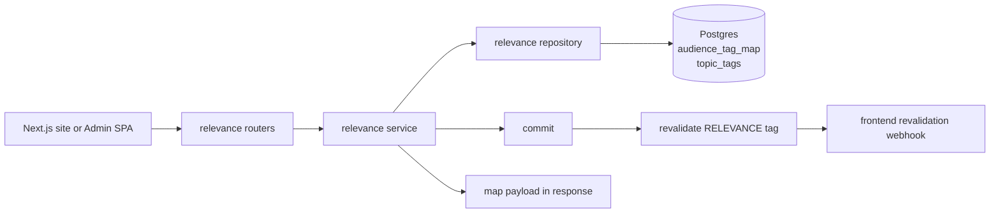
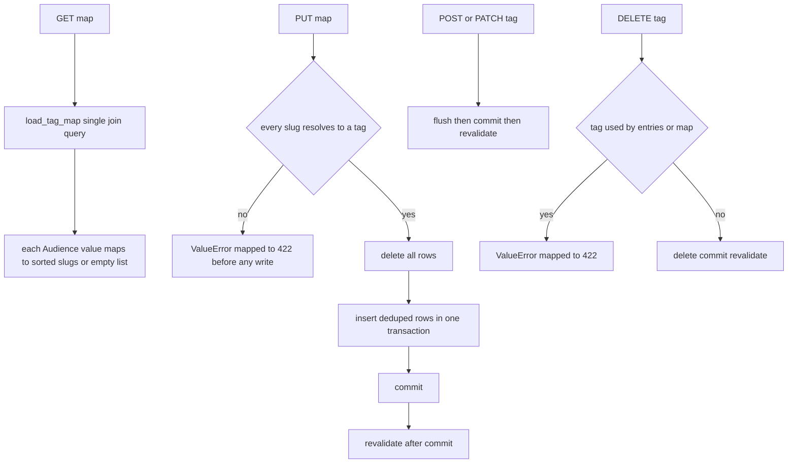

# Relevance — audience-to-topic-tag map powering per-audience content filtering

## Purpose

Stores which topic tags make a content entry relevant to which audience segment
(recruiters, techies, investors, founders, personal). The public map is shipped to
the Next.js site, which resolves per-item relevance with the mirrored `is_relevant`
resolver; the admin matrix lets the owner retarget audiences without a deploy. Topic
tag CRUD lives here too because the map references `topic_tags`.

## API Surface

| Method | Path | Auth | Request -> Response | Notes |
| --- | --- | --- | --- | --- |
| GET | /api/v1/relevance/map | Public | none -> dict of audience to sorted slugs | Sets Cache-Control public max-age=300 |
| GET | /api/v1/admin/relevance/map | Admin | none -> same payload | Every Audience value present; empty list when unmapped |
| PUT | /api/v1/admin/relevance/map | Admin | AdminMapUpdate `{mapping}` -> updated payload | Full replace; unknown audience keys rejected by schema validator |
| GET | /api/v1/admin/tags | Admin | none -> list[TagOut] | id, slug, label ordered by slug |
| POST | /api/v1/admin/tags | Admin | TagCreate `{slug, label}` -> TagOut 201 | |
| PATCH | /api/v1/admin/tags/{tag_id} | Admin | TagUpdate `{label}` -> TagOut | Label-only rename; missing label 422 |
| DELETE | /api/v1/admin/tags/{tag_id} | Admin | none -> 204 | 422 while the tag is referenced by content or the map |

## Data Flow

`is_relevant` never touches the database: callers load the tag map once per request
and resolve each item with pure set intersection.

## Functionality

## Files To Reference

- backend/app/features/relevance/endpoints/router.py — public, admin-map, and tag routers
- backend/app/features/relevance/service.py — is_relevant contract, update_map ordering
- backend/app/features/relevance/repository.py — load_tag_map, replace_map, tag_in_use
- backend/app/features/relevance/models.py — AudienceTagMap
- backend/app/features/relevance/schemas.py — AdminMapUpdate validator, TagOut
- backend/app/core/models.py — TopicTag definition (slug lowercase constraint)
- backend/app/core/cache_tags.py — RELEVANCE literal
- frontend/src/lib/relevance.ts — TypeScript mirror of is_relevant

## Invariants

- `is_relevant` is plain data in, bool out: no ORM objects and no database access.
  Its signature and body must stay identical to `frontend/src/lib/relevance.ts`.
- Only topic tags enter `audience_tag_map`; collection tags never do (conventions
  invariant 9). The unique constraint allows one row per audience-tag pair.
- `replace_map` validates every slug before writing anything and collapses duplicate
  slugs per audience so the payload cannot violate the unique constraint.
- Commit happens BEFORE `revalidate([RELEVANCE])`; revalidating a transaction that
  could roll back would publish a lie. Revalidation failures log at ERROR but never
  raise.
- The public payload always includes every Audience enum value with sorted slugs for
  stable JSON, and is cached aggressively because it changes rarely.
- Tags still referenced by content entries or the map cannot be deleted; the check
  covers both `audience_tag_map` and `timeline_topic_tags`.
- Repository never imports FastAPI; ValueError becomes HTTP 422 only in the router.
