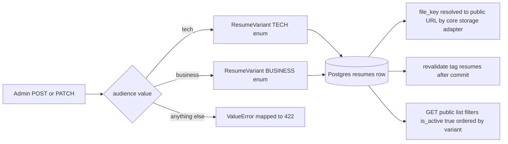
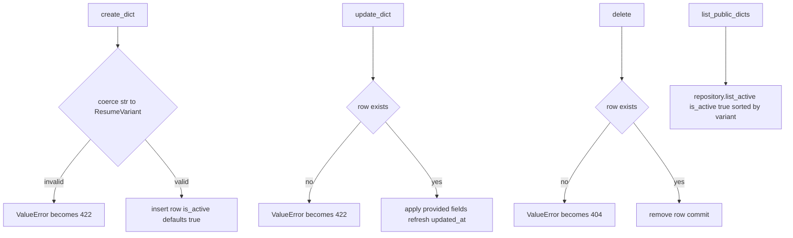

# Resumes — audience-variant resume registry over object storage keys

## Purpose

Stores metadata rows for downloadable resumes in two audience variants,
`tech` and `business`, each pointing at an uploaded file through a
`file_key` object-storage key. The public site reads only active rows; the
admin SPA gets full CRUD. Every mutating endpoint revalidates the `resumes`
cache tag so the Next.js ISR cache picks up changes immediately.

## API Surface

| Method | Path | Auth | Request -> Response | Notes |
| --- | --- | --- | --- | --- |
| GET | /api/v1/resumes | Public | none -> ResumePublic list | Active rows only, ordered by variant ascending |
| GET | /api/v1/admin/resumes | Admin cookie | none -> ResumeAdmin list | All rows including inactive |
| GET | /api/v1/admin/resumes/{resume_id} | Admin cookie | none -> ResumeAdmin | 404 when missing |
| POST | /api/v1/admin/resumes | Admin cookie | ResumeCreate variant label file_key is_active -> 201 ResumeAdmin | Bad variant string 422; revalidates |
| PATCH | /api/v1/admin/resumes/{resume_id} | Admin cookie | ResumeUpdate partial fields -> ResumeAdmin | Unknown id 422; revalidates |
| DELETE | /api/v1/admin/resumes/{resume_id} | Admin cookie | none -> 204 empty | Unknown id 404; revalidates |

ResumePublic and ResumeAdmin expose the same fields: id, variant, label,
file_key, is_active, created_at, updated_at.

## Data Flow

`file_key` is only a key: this feature never touches boto3. The storage
adapter in core/storage.py maps keys to URLs — the R2 public base URL in
production or `/media/<key>` on local disk — and its content-hashed keys mean
replacing bytes yields a new URL, so no resume URL can serve stale content.
Revalidation posts to the frontend webhook after commit via
core/revalidation.py.

## Functionality

The router maps service ValueError by endpoint: 422 for create and update,
404 for get and delete. Enum coercion happens in the service — request
schemas keep `variant` as a plain str, so an out-of-enum value fails at the
service boundary with a clear message rather than an opaque DB error.

## Files To Reference

- backend/app/features/resumes/endpoints/router.py — public read-only plus admin CRUD routes
- backend/app/features/resumes/service.py — dict conversion, enum coercion, delete guard
- backend/app/features/resumes/repository.py — list_active, list_all, get, create, update, delete
- backend/app/features/resumes/models.py — ResumeVariant enum, Resume columns
- backend/app/features/resumes/schemas.py — ResumePublic, ResumeCreate, ResumeUpdate
- backend/app/core/storage.py — StorageAdapter mapping file_key to R2 or local-disk URLs
- backend/app/core/revalidation.py and core/cache_tags.py — RESUMES tag revalidation after mutations

## Invariants

- The variant column is a Postgres enum `resume_variant` with exactly two
  values, tech and business; writes coerce strings and reject anything else.
- is_active gates public visibility only. Nothing in the code enforces a
  single active resume per variant — multiple TECH or BUSINESS rows can be
  live at once, and admins see every row regardless of state.
- Resumes deliberately have no publishable/status mixin; visibility is
  purely the is_active boolean, defaulting to true on create.
- Mutating endpoints call revalidate with tag `resumes` after the commit;
  the literal must match frontend/lib/cacheTags.ts or revalidation no-ops.
- Deleting a resume removes only the row; the underlying stored object is
  left untouched because the feature never calls the storage adapter.
