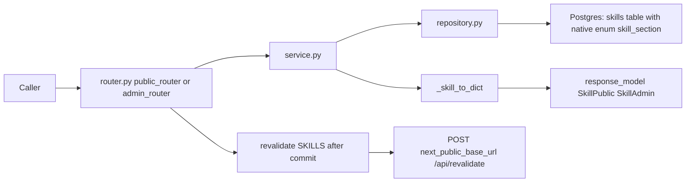
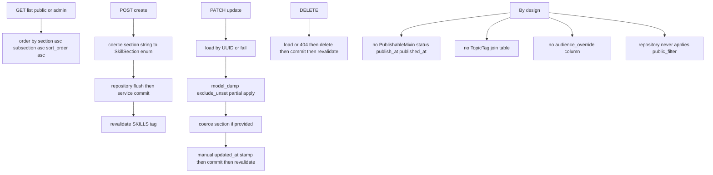

# Skills — Flat ordered skill inventory, always publicly visible

## Purpose

CRUD for the `skills` content type: names grouped by a fixed section enum and an
optional free-text subsection. Skills deliberately carry no publish lifecycle, no
topic tags, and no audience override — every visitor sees the full list, so there
is no relevance filtering anywhere in this feature.

## API Surface

| Method | Path | Auth | Request -> Response | Notes |
| --- | --- | --- | --- | --- |
| GET | `/api/v1/skills` | none | -> `SkillPublic[]` | Same data as admin list; no filter applied |
| GET | `/api/v1/admin/skills` | admin_auth | -> `SkillAdmin[]` | Identical shape to public (`SkillAdmin` is `SkillPublic`) |
| GET | `/api/v1/admin/skills/{skill_id}` | admin_auth | -> `SkillAdmin` | 404 if absent; no public detail endpoint exists |
| POST | `/api/v1/admin/skills` | admin_auth | `SkillCreate` -> 201 `SkillAdmin` | `section` must be a valid enum value else 422 |
| PATCH | `/api/v1/admin/skills/{skill_id}` | admin_auth | `SkillUpdate` -> `SkillAdmin` | Partial update; missing id -> 422 via ValueError |
| DELETE | `/api/v1/admin/skills/{skill_id}` | admin_auth | -> 204 | Missing id -> 404 |

`admin_auth` = signed session cookie plus Cloudflare Access verification
(`core/deps.py`). There is no slug lookup and no public single-skill route.

## Data Flow

No storage/R2 hop and no tag join: skills reference icons only by string slugs.

## Functionality

Sections are the closed set `languages`, `tools`, `frameworks`, `ai`, `business`
(`SkillSection` StrEnum persisted as native Postgres enum `skill_section`).
`icon_slug`/`icon_key` are opaque strings consumed by the frontend icon pipeline.

## Files To Reference

- backend/app/features/skills/models.py — `Skill`, `SkillSection`
- backend/app/features/skills/schemas.py — `SkillPublic/Admin/Create/Update`
- backend/app/features/skills/repository.py — `list_all` ordering, plain CRUD
- backend/app/features/skills/service.py — dict conversion, section coercion
- backend/app/features/skills/endpoints/router.py — route table, revalidation calls
- backend/app/core/models.py — `SortableMixin` (`sort_order`), `TimestampMixin`

## Invariants

- No publishing logic: repository docstring states skills are "always visible —
  no public_filter". Adding status/tags here would violate the feature contract.
- Service returns dicts to avoid MissingGreenlet; schemas have no `from_attributes`.
- Repository imports no FastAPI.
- `revalidate([SKILLS])` fires only after a successful commit and never raises;
  the literal `"skills"` must match `frontend/lib/cacheTags.ts`.
- Ordering is deterministic: section, then subsection, then `sort_order`; rows are
  UUID-keyed so IDs are not enumerable on the public API.
