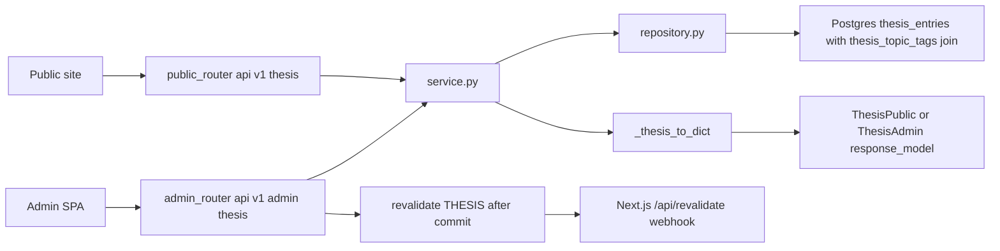
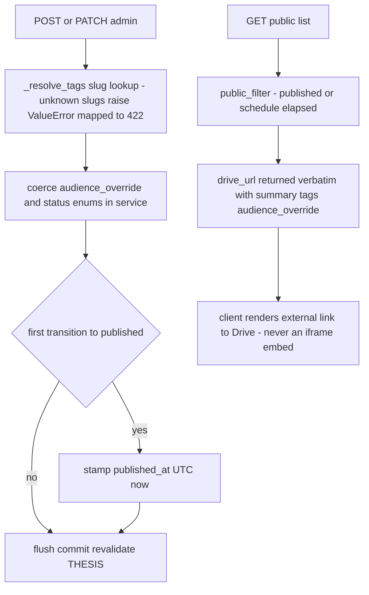

# Thesis — Investment thesis entries linking out to Google Drive documents

## Purpose

CRUD for the `thesis` content type: titled, dated entries whose payload is a
`drive_url` pointing at a Google Drive document. The backend stores and returns
the URL verbatim; it never fetches, proxies, or embeds the document. Rendering
is a link-out decision left entirely to the client.

## API Surface

| Method | Path | Auth | Request -> Response | Notes |
| --- | --- | --- | --- | --- |
| GET | `/api/v1/thesis` | none | -> `ThesisPublic[]` | `public_filter` applied; ordered by published_date desc then sort_order asc |
| GET | `/api/v1/thesis/{thesis_id}` | none | -> `ThesisPublic` | 404 if absent or unpublished |
| GET | `/api/v1/admin/thesis` | admin_auth | -> `ThesisAdmin[]` | Bypasses `public_filter`; adds status/publish fields |
| GET | `/api/v1/admin/thesis/{thesis_id}` | admin_auth | -> `ThesisAdmin` | 404 if absent |
| POST | `/api/v1/admin/thesis` | admin_auth | `ThesisCreate` -> 201 `ThesisAdmin` | Unknown `tag_slugs` -> 422 |
| PATCH | `/api/v1/admin/thesis/{thesis_id}` | admin_auth | `ThesisUpdate` -> `ThesisAdmin` | Partial; first publish stamps `published_at` |
| DELETE | `/api/v1/admin/thesis/{thesis_id}` | admin_auth | -> 204 | Missing id -> 404 |

All write paths call `revalidate([THESIS])` after commit.

## Data Flow

## Functionality

`drive_url` is a required non-null `String(2000)`; `published_date` is also
non-nullable, unlike the nullable equivalent on posts. There is no server-side
Drive integration of any kind — no OAuth, no file listing, no embed endpoint —
so a signed-out visitor can always follow the link (given the document's share
setting) but the page itself stays static and cheap.

## Files To Reference

- backend/app/features/thesis/models.py — `Thesis`, `thesis_topic_tags`
- backend/app/features/thesis/schemas.py — `ThesisPublic/Admin/Create/Update`
- backend/app/features/thesis/repository.py — public vs admin queries, tag attach
- backend/app/features/thesis/service.py — dict conversion, enum coercion, tag resolution
- backend/app/features/thesis/endpoints/router.py — route table, revalidation calls
- backend/app/core/models.py — `PublishableMixin`, `TopicTag`
- backend/app/core/cache_tags.py and core/revalidation.py — `THESIS` tag plumbing

## Invariants

- `drive_url` links out, never iframes: Drive documents cannot be reliably
  embedded for signed-out visitors; do not add proxy/embed endpoints here.
- Tags use a feature-specific join table (`thesis_topic_tags`), never a
  polymorphic tag join shared across content types.
- Service returns plain dicts; schemas declare no `from_attributes` (MissingGreenlet).
- Public reads must go through `public_filter` from `core/queries.py`; admin bypasses explicitly.
- `published_at` is stamped only when transitioning into `PUBLISHED`.
- `revalidate([THESIS])` runs strictly after commit and never raises; the
  `"thesis"` literal must stay in sync with `frontend/lib/cacheTags.ts`.
