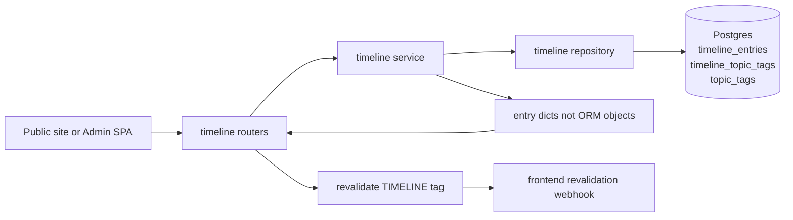
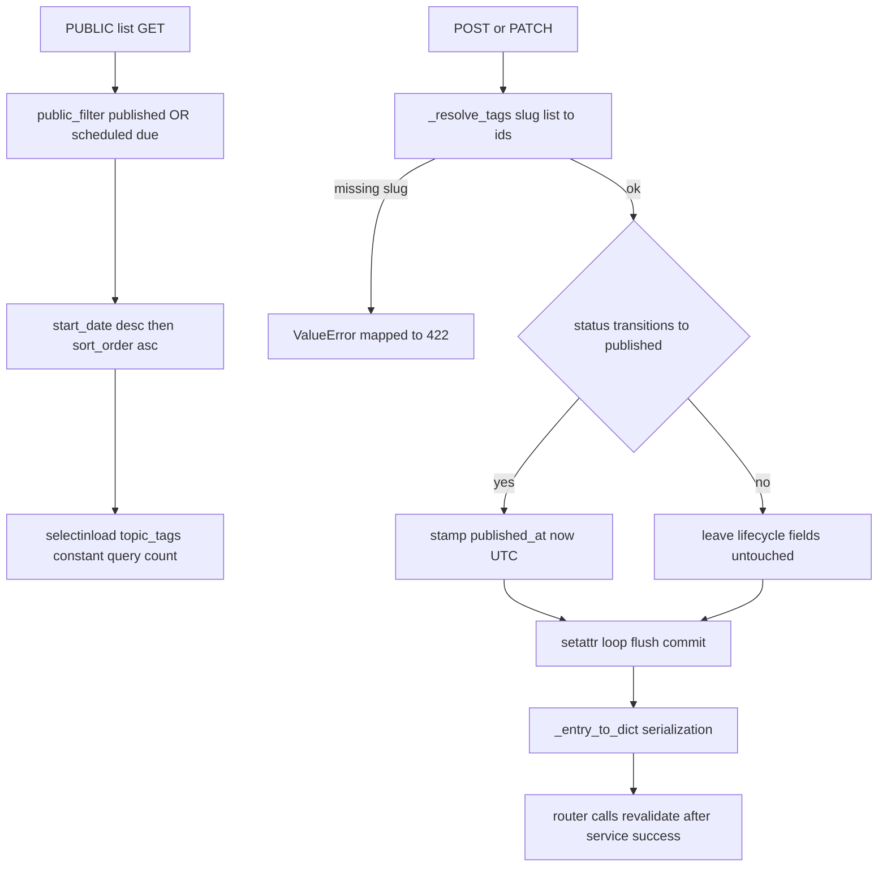

# Timeline — unified education and experience entries with publish lifecycle

## Purpose

One chronological content type covering education and professional history for the
public timeline page. Entries carry topic tags plus an optional per-entry audience
override array, so the audience filter can surface or pin entries per segment.
Public reads are filtered to published rows; the admin SPA gets full CRUD over all
statuses.

## API Surface

| Method | Path | Auth | Request -> Response | Notes |
| --- | --- | --- | --- | --- |
| GET | /api/v1/timeline | Public | none -> list[TimelineEntryPublic] | public_filter applied; start_date DESC then sort_order ASC |
| GET | /api/v1/timeline/{entry_id} | Public | none -> TimelineEntryPublic | Fetches by id regardless of status; 404 only if id unknown |
| GET | /api/v1/admin/timeline | Admin | none -> list[TimelineEntryAdmin] | Includes drafts and scheduled |
| GET | /api/v1/admin/timeline/{entry_id} | Admin | none -> TimelineEntryAdmin | Adds status, publish_at, published_at, audience_override |
| POST | /api/v1/admin/timeline | Admin | TimelineEntryCreate -> TimelineEntryAdmin 201 | Revalidates TIMELINE tag on success |
| PATCH | /api/v1/admin/timeline/{entry_id} | Admin | TimelineEntryUpdate -> TimelineEntryAdmin | Partial; unknown tag slugs return 422 |
| DELETE | /api/v1/admin/timeline/{entry_id} | Admin | none -> 204 | Unknown id returns 404 |

## Data Flow

## Functionality

## Files To Reference

- backend/app/features/timeline/endpoints/router.py — both routers, revalidate calls
- backend/app/features/timeline/service.py — orchestration, publish transition, _entry_to_dict
- backend/app/features/timeline/repository.py — list_public, get, create, update, delete
- backend/app/features/timeline/models.py — TimelineEntry, TimelineKind, timeline_topic_tags
- backend/app/features/timeline/schemas.py — public/admin/create/update shapes
- backend/app/core/queries.py — public_filter definition
- backend/app/core/models.py — PublishableMixin, SortableMixin, TopicTag
- backend/app/core/cache_tags.py — TIMELINE literal

## Invariants

- One model serves education and experience; they differ only by the `kind` values
  `education` and `experience`, rendered in one chronological list.
- Services return plain dicts, never ORM objects, to avoid MissingGreenlet from
  expired attributes after flush; routers rebuild Pydantic models from those dicts.
- Public list reads must go through `public_filter` from core.queries (status
  published, or scheduled with publish_at due); admin reads bypass it explicitly.
  The by-id lookups do not apply the filter.
- `list_public` keeps a constant number of queries via selectinload of topic_tags;
  no N+1 regardless of entry count.
- `published_at` is stamped only when a draft or scheduled entry becomes published,
  computed locally in UTC before commit.
- `end_date` must be on or after `start_date`, enforced by validators on both create
  and update schemas.
- Tag changes are slug-based: unknown slugs raise ValueError before any write, and a
  null `tag_slugs` on update preserves existing tags.
- Router calls `revalidate([TIMELINE])` only after the service commits successfully.
