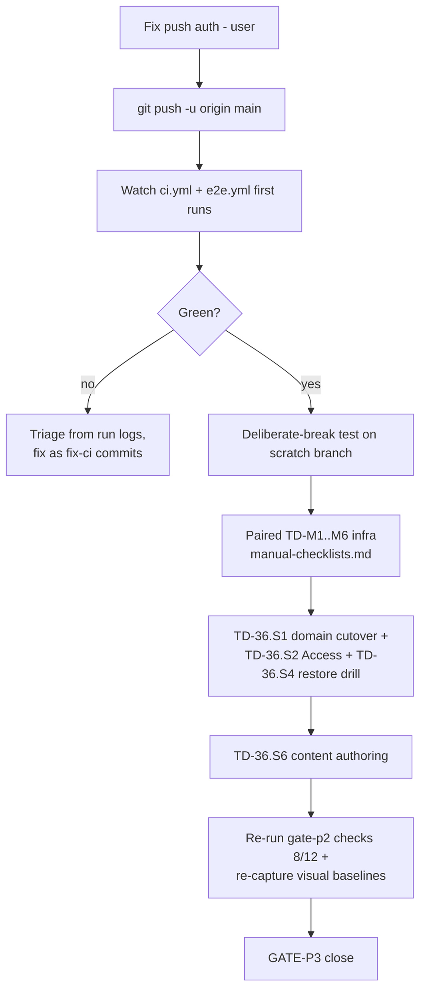

# HANDOFF — Session 5 (Engagement Session 2: Rescue, CI, Docs Architecture)

**Written:** end of engagement session 2 · **Next session:** push auth → CI first runs → paired manual infra (TD-M1..M6) → launch prep
**Start here:** this file, then `development_plan/todos/README.md` (now truthful), then `docs/post-development/session-2/session-2-summary.md`.

---

## 1. What happened this session

The previous agent session had built ALL of P3 (TD-31..35, GlitchTip, Playwright suites, admin gap-fill) but **committed nothing** — 130 files sat unverified in the working tree while its handoff claimed completion. This session rescued that work:

1. **Verified from scratch** (S2_T01): throwaway Postgres on :15432 (host :5432 was another project's) → 169+2 pytest, ruff/mypy/tsc clean, single alembic head. Found real defects the claims had hidden: stale `openapi.json`, `(window as any)` ×6, dead code branches, vitest swallowing Playwright specs.
2. **Committed everything** (S2_T02): hygiene `b85bac7` → feat(p3) `6a8dfde` (130 files) → docs `e5113c4`.
3. **Scrubbed the leaked PAT** from living docs; history purge deliberately deferred to engagement end (user decision).
4. **Docs architecture** (S2_T03): `docs/specs/{session-1,session-2}`, `docs/post-development/`, handoff dir moved to `docs/handoff/`; status board corrected; executed-work catalog written.
5. **GATE-P2 scripted evidence** (S2_T04): 9/12 criteria green against a production build — SSR 13/13, SEO assets 6/6, JSON-LD valid Person, registries OK. `.pdf` crawlability + placeholder identity values blocked on content authoring only.
6. **CI/CD landed** (S2_T05/T06): `.github/workflows/{ci,e2e,deploy}.yml`. Production build proven locally: all content routes static.
7. **Feature documentation** (S2_T07): `docs/features/<name>.md` ×14 with mermaid diagrams + index.

## 2. Status board (post-session)

| Block | State |
|---|---|
| P0–P3 development | ✅ All committed (`841aa4b` head) |
| GATE-P2 | 🔶 Scripted 9/12 green (`docs/post-development/session-2/gate-p2-evidence.md`); browser/device items route to CI e2e or user |
| TD-12..15 CI/CD | [~] Workflows committed; **first remote run blocked on push auth** |
| TD-M1..M6 manual infra | [ ] User-executed — checklists in `docs/handoff/manual-checklists.md` |
| TD-36 Launch | [ ] Paired — cutover, Access, backup drill, content authoring |

## 3. 🔴 Immediate blockers for next session

1. **Push auth (403).** Keychain credential belongs to `feenix-sid-2k26`, which cannot write to `github.com/SIDDHESHCHAUDHARI2K24/portfolio-sid`. Fix ONE of:
   - add `feenix-sid-2k26` as collaborator (write),
   - switch origin to SSH with an authorized key,
   - provide a fine-grained PAT (then update keychain).
   After first successful push: confirm ci.yml + e2e.yml green, then run the deliberate-break test.
2. **History purge** (filter-repo + force-push for the old PAT) — scheduled at END of engagement so it happens once. Do NOT forget.

## 4. Execution protocol for next session

Standing rules still in force: conventions invariants; regenerate OpenAPI + both api.d.ts together after schema changes; one alembic head via `scripts/regen_migration.sh`; never commit secrets; conventional commits.

## 5. Documents for next session

| Priority | Document |
|---|---|
| 1 | This file |
| 2 | `docs/post-development/session-2/session-2-summary.md` |
| 3 | `development_plan/todos/README.md` (corrected board) |
| 4 | `docs/post-development/session-2/gate-p2-evidence.md` |
| 5 | `docs/handoff/manual-checklists.md` (TD-M1..M6 steps) |
| 6 | `docs/features/README.md` (feature docs index) |
| 7 | `docs/conventions.md` · `docs/handoff/env-vars-registry.md` |

## 6. Local environment notes
- Throwaway test Postgres container `portfolio-pg-t1` on host port **15432** may still be running (`docker rm -f portfolio-pg-t1` to clean). The project's own compose stack is stopped; its volumes are intact.
- uvicorn :8000 / next start :3000 were left running during verification — kill if still up.

## 7. Lessons learned (new this session)
1. **Handoff claims ≠ state.** Session 4's "all clean" was true for lint/type tests but false for contract artifacts and git state. Always re-run gates against the tree you were handed.
2. **Host-port collisions across projects**: never bind shared ports; prefer throwaway containers on high ports + env overrides (DATABASE_URL pattern worked perfectly).
3. **Vitest default globs eat Playwright specs** in mixed repos — scope includes/excludes explicitly per runner.
4. **BSD sed breaks on multibyte emoji in patterns** — use perl -i -pe for unicode-bearing edits.
5. **Sub-agent network failures**: retry once, then fall back to inline rather than stalling (two consecutive provider errors occurred mid-session; dispatch recovered later).
