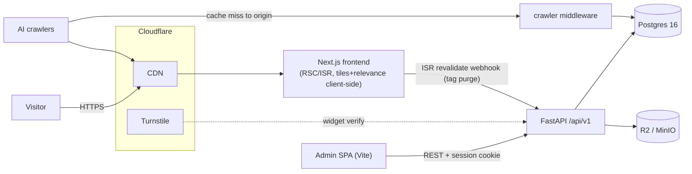

# Post-Development Report — Initial Build-Out (Phases P0–P3)

**Scope:** Record of what was actually built during the initial build-out (original agent sessions 1–4), as distinct from the plans that drove it. Session-2 work (CI, docs restructure, launch prep) is documented separately under `docs/post-development/session-2/` and `docs/specs/session-2/`.

The project is an audience-segmented portfolio: a server-rendered Next.js public site whose content is filtered per audience (Recruiters / Techies / Investors / Founders / Personal) by a client-side relevance engine, a Vite+React admin SPA for authoring, and a FastAPI + SQLAlchemy 2 async backend on Postgres with R2/MinIO object storage. All phases P0–P3 development landed; CI workflows, manual cloud infra, and launch remain.

## What Was Built (per phase)

### P0 — Foundations
Backend/frontend/admin scaffolds; Docker Compose (Postgres 16 + MinIO + bucket init); async Alembic with a models registry and single-head invariant; StorageAdapter abstracting S3-compatible storage (content-hashed keys); multi-stage backend Dockerfile serving API + admin from one container. Design system established in `docs/DESIGN.md` and mapped to Tailwind v4 `@theme inline` tokens in both frontends (dark-only theme; amber `#E8B34B` reserved exclusively for relevance highlighting).

### P1 — Backend Spine
Core data foundations (`UUIDMixin`, `TimestampMixin`, `SortableMixin`, `PublishableMixin` with draft/scheduled/published lifecycle, shared `TopicTag`); admin auth (Argon2 password + email OTP via Resend, session cookies, lockout); the relevance engine (`audience_tag_map` table plus a pure `is_relevant` resolver resolved **client-side** so pages stay cacheable); publishing pipeline (revalidation webhook triggers ISR tag purges, scheduler cron flips due scheduled entries, `public_filter` query helper); timeline feature slice end-to-end; frontend shell (OpenAPI typegen → `api.d.ts`, category cookie provider); admin shell (login/guard, Timeline CRUD, tag-map matrix).

### P2 — Content Tracks (six parallel tracks)
- **A Projects** — projects with markdown bodies, attachments (PDF/PPT/image), nullable timeline FK with `/timeline#entry-{id}` cross-linking.
- **B Skills + Certifications** — skills grouped by section (deliberately no relevance filtering); certifications with credential files and mobile PDF fallback.
- **C Thesis + Posts** — three themed external-post pages sharing one list component; enforced separation of routing collections vs relevance topic_tags.
- **D Collections + ProsePages** — books/anime/manhwa with a cover pipeline (Open Library/Jikan fetch → validate → store in R2; never hotlinked at render); sanitized markdown prose pages.
- **E Resume + Forms** — tech/business resume variants mapped to audiences; contact/dealflow forms behind honeypot → Turnstile → rate-limit → DB write with generic success responses; Resend notification fire-and-forget; admin inbox with CSV export.
- **F Intro Sequence + Audio** — 6-adjective intro animation morphing into the category selector (Framer Motion `layoutId`), sessionStorage/reduced-motion guards, fixed-overlay invariant (never replaces server content); ambient audio persisted across navigation, off by default.

### P3 — Convergence
Per-audience tile arrangement as pure configuration (`frontend/config/tileArrangement.ts`) with `is_pinned` pinning overriding recency in tile summaries; empty-tile omission; hero image support. SEO suite: `Person` JSON-LD generated from live DB data, sitemap/robots explicitly allowing AI crawlers (GPTBot, ClaudeBot, PerplexityBot, CCBot, Google-Extended), canonical bare paths, `llms.txt`. Crawler analytics: `CrawlerHit` table fed by origin middleware with SHA-hashed IPs and known-agent classification, admin panel with undercount caveat. DESIGN.md v2 refinement, accessibility audit (`docs/a11y-perf-audit.md`), Playwright visual baselines (12 pages × breakpoints), critical-journey specs, and GlitchTip error tracking (Sentry-SDK compatible, env-gated).

## System Architecture

## Key Invariants Enforced

- Public pages are fully server-rendered; raw HTML must carry content without JS (curl-verifiable).
- The intro is a fixed overlay above server-rendered content — never a conditional replacement.
- Relevance resolves client-side against a shipped tag map; servers never branch on audience for cacheability.
- Services serialize ORM rows to dicts before any await; Pydantic models build from dicts (`from_attributes=True` is banned).
- Exactly one Alembic head at all times; migrations generated only via `scripts/regen_migration.sh`.
- Every feature model appears in `models_registry.py`; every router in `app.py` (`scripts/check_registries.py`).
- Covers/media render only from R2 URLs — third-party image hosts are never hotlinked.
- Amber (`--relevant`) is used for relevance highlighting only.
- Hex literals are banned in component code; all colour flows through design tokens.
- Form endpoints return one generic success regardless of anti-abuse outcome.
- OpenAPI export + both `api.d.ts` regenerate together after any schema change.
- Secrets live only in env vars; never in git.

## Deviations & Parked Findings

Tailwind v4 CSS-first config instead of the planned v3 `tailwind.config.ts`; GlitchTip chosen over Sentry for error tracking (single-container, SDK-compatible); Stitch visual pass deferred (DESIGN.md authored from the approved brief); drag-to-reorder in Skills admin replaced by numeric sort inputs; attachment/file uploads entered as keys via text fields (no upload widget yet); real-device PDF fallback unverified; Resend notifications untested without a live domain; visual baselines captured pre-content (re-capture scheduled post-authoring).

## Verification State At Time Of Writing

169 pytest passed + 2 skipped · ruff clean · mypy clean across 159 files · exactly one Alembic head (`4d50231ae3d7`) · frontend/admin tsc clean · eslint 0 errors (5 `next/image` warnings deferred to the perf task) · OpenAPI + typegen regenerated · Playwright configured with baselines.

## Where Things Live

| Area | Path |
|---|---|
| Backend features (14) | `backend/app/features/{auth,certifications,collections,crawlers,forms,overview,posts,projects,prose,relevance,resumes,skills,thesis,timeline}/` |
| Core (models, enums, storage, revalidation, turnstile, glitchtip) | `backend/app/core/` |
| Public site | `frontend/app/**`, components in `frontend/components/**`, config in `frontend/config/tileArrangement.ts`, SEO in `frontend/lib/jsonld.ts` + `frontend/app/{sitemap.ts,robots.ts,llms.txt/route.ts}` |
| Admin SPA | `admin/src/routes/**`, shared fields in `admin/src/components/fields/` |
| Executed spec cards | `development_plan/todos/p{0..3}/` (catalog: `docs/specs/session-1/README.md`) |
| Handoffs & ops checklists | `docs/handoff/` |
| This phase's specs | `docs/specs/session-2/` |
| Post-development reports | `docs/post-development/session-{1,2}/` |
