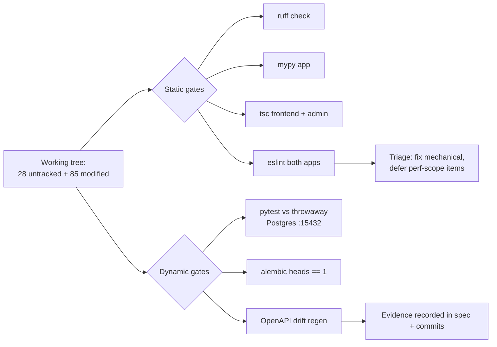

# S2_T01 — Baseline Verification of Uncommitted P3 Work

| Field | Value |
|---|---|
| **Spec** | `S2_T01_20260822-2212_baseline-verification.md` |
| **Phase / Session** | S2 · Task 1 |
| **Executor** | agent |
| **Depends on** | nothing (first task of the session) |
| **Blocks** | S2_T02, and every later task |
| **Status** | ✅ DONE — results recorded below |

## Purpose
A previous session implemented all P3 convergence work (TD-31..35) but never committed it; its handoff claimed green checks that were unproven. Before committing 130 files, every quality gate had to be re-run from scratch so the commits carry verified truth instead of inherited claims.

## What Was Done & Where

- Environment decision (recorded): the project's own `docker compose` Postgres could not bind host port 5432 (occupied by an unrelated project). Tests ran against a throwaway container on **15432** via `DATABASE_URL` override — zero impact on other projects or existing volumes.
- **Results:** 169 passed + 2 skipped (=171 collected, matching handoff claim) · ruff clean · mypy clean (159 files) · exactly one Alembic head `4d50231ae3d7` · frontend/admin tsc clean.
- **Defects found and fixed during triage** (all pre-existing session-4 leftovers):
  - OpenAPI drift: committed `openapi.json` lacked crawler endpoints → regenerated spec + both `api.d.ts`.
  - Frontend eslint 10 errors / 12 warnings → fixed: typed Turnstile accessor replacing `(window as any)` ×6 in `frontend/features/forms/*`, dead identical success branches collapsed, unused imports/vars removed across 9 files, `AudioPlayer` ref-write moved into an effect, volume-sync deps corrected.
  - 4 `react-hooks/set-state-in-effect` errors assessed as intentional hydration-safe bootstrap patterns (`CategoryProvider`, `IntroOverlay`, `TimelineClient`) → scoped ESLint override with rationale comment rather than risky rewrites (protects the overlay invariant).
  - 5 remaining `` warnings deliberately deferred to the TD-35 perf scope (next/image conversions).
  - `.gitignore` extended with `playwright-report/` + `test-results/`.
  - Discovered `frontend/features/forms/` was required by committed pages but untracked — public repo was effectively broken without it.

## Acceptance Criteria (met)
- [x] All static gates pass or have recorded, justified dispositions
- [x] Test suite passes against a clean database
- [x] Contract artifacts regenerated together (openapi.json + api.d.ts ×2)
- [x] Every deviation decision recorded explicitly in this spec

## References
`docs/handoff/HANDOFF-SESSION-4.md` §4 (claims under test) · `docs/conventions.md` (invariants) · `development_plan/todos/p0/TD-12-ci-quality-tests.md` (gate definitions reused here manually ahead of CI wiring)

## Dependencies
None. Output feeds S2_T02 commit staging.
