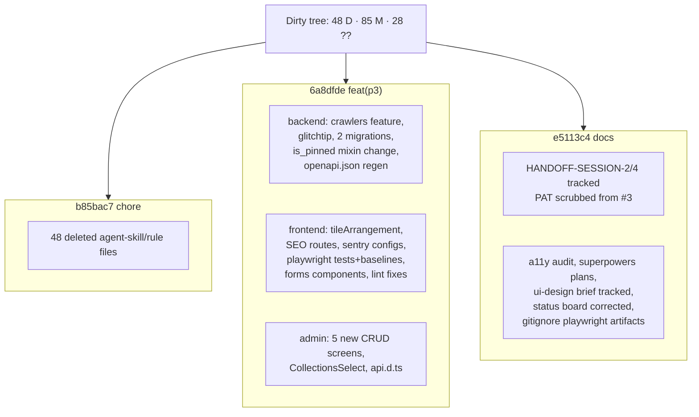

# S2_T02 — Commit Uncommitted P3 Work + Credential Hygiene

| Field | Value |
|---|---|
| **Spec** | `S2_T02_20260822-2212_commit-uncommitted-p3.md` |
| **Phase / Session** | S2 · Task 2 |
| **Executor** | agent |
| **Depends on** | S2_T01 (verified baseline) |
| **Blocks** | S2_T03..T09, remote push |
| **Status** | ✅ DONE — commits `b85bac7`, `6a8dfde`, `e5113c4` |

## Purpose
All P3 development existed only in the working tree; any checkout, CI run, or disk failure would lose it. Additionally a live GitHub PAT was embedded in committed history inside `HANDOFF-SESSION-3.md`. This task lands the work as reviewable conventional commits and removes the credential from all living documentation.

## Security handling (user-approved decision)
- **Now:** PAT value removed from `docs/handoff/HANDOFF-SESSION-3.md`; secret scan (`ghp_`, `github_pat_`, `sk-ant`, `AKIA`, private-key markers) over all staged content — clean.
- **Deferred deliberately to session end:** full git-history purge (`git filter-repo`) + force-push, so exactly one history rewrite is needed after all remaining commits land. Tracked as S2_T09 follow-through / session-3 item.

## Commit plan & functionality

Shared-file reality check: several modified files (`models_registry.py`, `app.py`, sidebar, tiles registry) interleave changes from multiple P3 tasks in the same hunks. Splitting them into per-TD commits would require surgical hunk staging with no verification benefit — decision recorded: **one comprehensive `feat(p3)` commit**, mirroring how the work was actually produced.

## Expected changes / where
Repo history only; working tree clean afterwards (`git status` → 0 entries).

## Acceptance Criteria (met)
- [x] Three conventional commits, each self-consistent (code compiles at every commit point)
- [x] No secrets in any committed content (scan evidence above)
- [x] Working tree clean post-commit
- [x] Identity matches prior commit history

## References
`docs/specs/session-2/S2_T01_20260822-2212_baseline-verification.md` · `docs/conventions.md` §merge rules · AGENTS.md commit conventions

## Dependencies
Requires S2_T01 green gates. Enables push + everything downstream.
