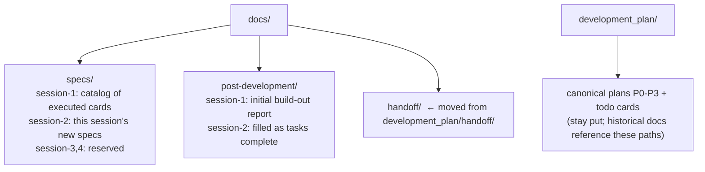
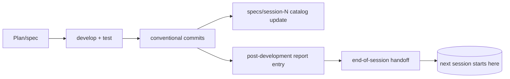

# S2_T03 — Documentation Restructure & Cleanup

| Field | Value |
|---|---|
| **Spec** | `S2_T03_20260822-2212_docs-restructure-cleanup.md` |
| **Phase / Session** | S2 · Task 3 |
| **Executor** | agent |
| **Depends on** | S2_T02 (commits land first so catalogs reference real hashes) |
| **Blocks** | S2_T04..T09 (they write into the new structure) |
| **Status** | ✅ DONE |

## Purpose
The user's engagement model requires a durable documentation architecture: specs per session, post-development reports per session, one handoff home, and a truthful status board. Previously handoffs lived under `development_plan/handoff/`, no specs/post-development dirs existed, executed work had no catalog, and `development_plan/todos/README.md` still showed completed waves as `[ ]`.

## Target structure

## What was done & where

1. Created `docs/specs/session-{1,2}/`, `docs/post-development/session-{1,2}/`.
2. Moved `development_plan/handoff/` → `docs/handoff/` via `git mv` (9 files). Updated the single living pointer in `development_plan/todos/README.md`; historical handoff texts keep their original paths as period records.
3. Wrote `docs/specs/session-1/README.md` — catalog mapping every executed TD card → status → commit hash(es), including re-opened CI items pointing at session-2 specs. (User decision recorded: *reference + new-only* — existing TD cards stay canonical; no duplication.)
4. Wrote `docs/post-development/session-1/post-development-report.md` — narrative of the whole build-out with architecture mermaid, invariants, deviations.
5. Corrected the master status board (`development_plan/todos/README.md`): TD-10/11, TD-20..24, TD-25..30, TD-31..35 now reflect reality with caveats where partial (e.g. real-device PDF check pending); only genuinely pending rows remain `[ ]` (TD-12..15, TD-M*, TD-36).

## Functionality example
A future maintainer asks "was the cover pipeline ever built?" → opens `docs/specs/session-1/README.md` → P2 table row TD-28 → commit `e286656` → card at `development_plan/todos/p2/TD-28-track-d-collections-prose.md` for the original spec. Three hops, zero archaeology.

## Data flow (documentation lifecycle)

## Acceptance Criteria (met)
- [x] New dirs exist with content; nothing duplicated from canonical cards
- [x] `git mv` used — history preserved for moved handoffs
- [x] Status board matches verified state exactly
- [x] No broken living references to the old handoff path

## References
AGENTS.md ("single source of truth: docs/") · `docs/conventions.md` · user instructions (spec naming convention `<phase>_<task>_<timestamp>_<name>.md`)

## Dependencies
After S2_T02; before all remaining session-2 tasks.
