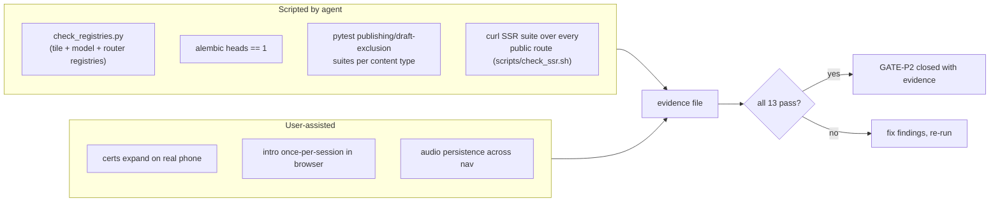

# S2_T04 — GATE-P2 Formal Verification

| Field | Value |
|---|---|
| **Spec** | `S2_T04_20260822-2212_gate-p2-verification.md` |
| **Phase / Session** | S2 · Task 4 |
| **Executor** | agent (scriptable items) + user (real-device item) |
| **Depends on** | S2_T02 (P3 code committed; gates run against final code) |
| **Blocks** | TD-36 launch work in session 3/4 |
| **Status** | 🔶 SCRIPTED PORTION DONE — 9/12 criteria green against production build; see `docs/post-development/session-2/gate-p2-evidence.md` (remaining: CI e2e first run after push auth · real-device PDF check · post-content re-run of pdf/email checks) |

## Purpose
`GATE-P2` was declared closed by the original session 4 without recorded evidence. The P3 plan makes tile registration the entry condition for convergence, so all 13 exit criteria must be demonstrably true before launch tasks proceed. Evidence-before-claims.

## What to do
Run each criterion from `development_plan/todos/p2/GATE-P2.md` against a live stack (docker compose Postgres/MinIO + backend + `next dev` or built frontend), recording command + output into `docs/post-development/session-2/gate-p2-evidence.md`.



## Expected changes / where
New file `docs/post-development/session-2/gate-p2-evidence.md`. Any code fixes the gate surfaces land as small `fix(p3): ...` commits referencing the failing criterion.

## Functionality & example
Example scripted check (email crawlability criterion):
```bash
curl -s localhost:3000/contact | grep -q '<email address>' && echo PASS
curl -s localhost:3000/ | grep -qi '\.pdf' && echo PASS
```
A criterion passes only when its exact verification command exits 0 against the running stack — never from reading code.

## Testing & acceptance criteria
- [ ] Every one of the 13 GATE-P2 checkboxes has a command transcript in the evidence file
- [ ] `alembic heads` output shows exactly one head on committed main
- [ ] Real-device PDF fallback either verified or explicitly re-parked with user sign-off
- [ ] Failures fixed before gate closure; evidence file committed

## References
`development_plan/todos/p2/GATE-P2.md` (criteria verbatim) · `docs/handoff/manual-checklists.md` · `docs/specs/session-2/S2_T05_20260822-2212_ci-quality-contract.md` (these checks become CI jobs)

## Dependencies
Needs running local stack (Postgres/MinIO via compose on free ports, same pattern as S2_T01) and seeded content for some checks.
