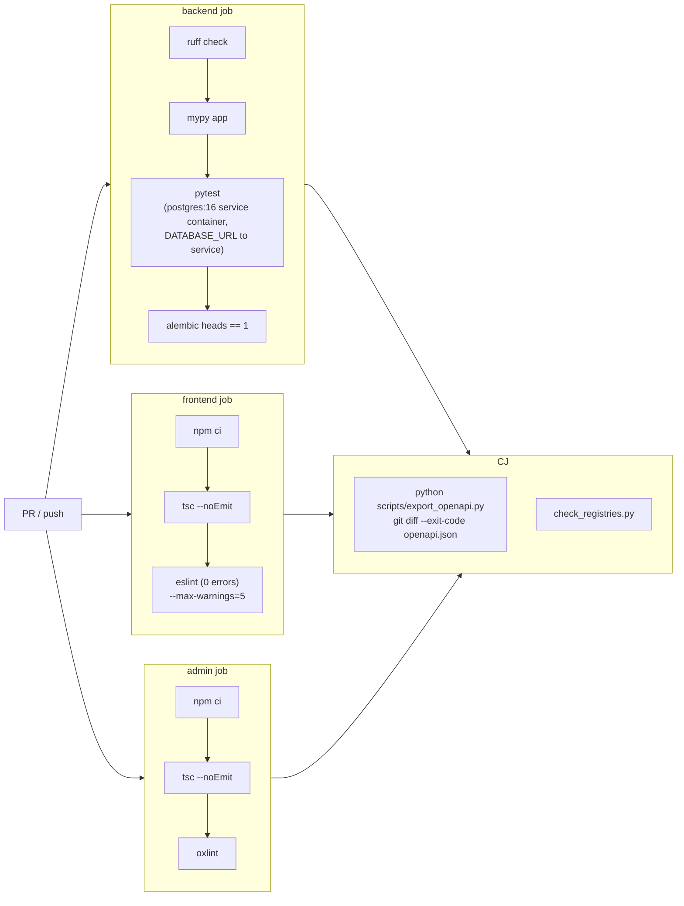

# S2_T05 — CI Pipeline: Quality Gates + Contract Checks

| Field | Value |
|---|---|
| **Spec** | `S2_T05_20260822-2212_ci-quality-contract.md` |
| **Phase / Session** | S2 · Task 5 |
| **Executor** | agent |
| **Canonical cards** | `development_plan/todos/p0/TD-12-ci-quality-tests.md`, `TD-13-ci-contract-checks.md` (steps NOT duplicated here) |
| **Depends on** | S2_T02 (green baseline committed); remote push enabled |
| **Blocks** | S2_T06 (e2e/deploy extend this pipeline) |
| **Status** | ⏳ PENDING |

## Purpose
Every gate that was run by hand in S2_T01 must become a pull-request gate so regressions cannot silently land. This is the single highest-leverage automation gap in the project: `.github/workflows/` does not exist yet.

## What to do
Create two workflow files under `.github/workflows/`:

**1. `ci.yml`** — triggered on PR + push to `main`; jobs run in parallel:

**2. Contract drift logic:** regenerate `openapi.json` in CI and fail on `git diff` output — exactly the check that caught session-4's stale spec during S2_T01.

## Expected changes / where
- Create: `.github/workflows/ci.yml`
- Possibly: small `backend/scripts/ci-check.sh` wrapper if the card's step list prefers one entrypoint.
- No application code changes expected.

## Functionality example
A PR adding a field to `ProjectCreate` without regenerating typegen: contract job runs `export_openapi.py`, `git diff --exit-code openapi.json` exits 1 with a visible diff → PR blocked with an actionable message instead of a stale contract reaching main.

## Environment decisions (recorded)
- Postgres service container binds inside the job network — no host port conflicts (unlike local runs).
- Secrets: none required for ci.yml (tests use known dev credentials). Turnstile/Resend paths are mocked in tests already.
- Warning budgets pinned to today's verified counts (`--max-warnings=5` frontend, oxlint warnings tolerated) so gates start green and tighten later rather than starting red and being ignored.

## Testing & acceptance criteria
- [ ] Workflow passes on `main` immediately after landing (run once via push)
- [ ] Deliberate break test: commit a lint error on a scratch branch → CI red with correct failing job
- [ ] OpenAPI drift simulation: touch a schema, skip regen → contract job fails
- [ ] Total wall time < ~8 min (pytest is the long pole at ~1 min locally)

## References
Cards `TD-12`/`TD-13` · commands proven in `docs/specs/session-2/S2_T01_20260822-2212_baseline-verification.md` · `docs/conventions.md` §77-78 (registry checks)

## Dependencies
After S2_T02; before S2_T06 which adds e2e/deploy jobs on top.
