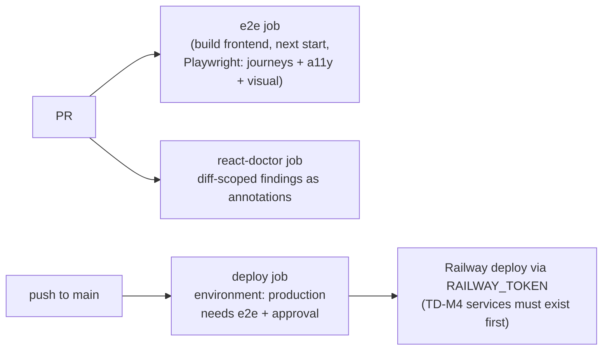

# S2_T06 — CI: E2E Journeys, react-doctor Gate, Deploy Workflow

| Field | Value |
|---|---|
| **Spec** | `S2_T06_20260822-2212_ci-e2e-deploy.md` |
| **Phase / Session** | S2 · Task 6 |
| **Executor** | agent |
| **Canonical cards** | `development_plan/todos/p0/TD-14-ci-e2e-react-doctor.md`, `TD-15-deploy-workflow.md` |
| **Depends on** | S2_T05 (base ci.yml exists) |
| **Blocks** | TD-36 launch readiness (deploy gate) |
| **Status** | DONE — 2b4685a; first remote run pending push auth |

## Purpose
Extend CI from "code is healthy" to "product behaves" and create the gated deploy path to Railway that manual infra (TD-M4..M6) will plug into.

## What to do

1. **E2E job** (`ci.yml` extension or `e2e.yml`): build the Next.js app, serve it, run the three Playwright suites committed in `6a8dfde` — `tests/journeys/critical.spec.ts`, `tests/accessibility/*`, visual baselines (Linux snapshots must be generated once; darwin baselines stay local-only or get regenerated per-platform runner).
2. **SSR curl check**: extend `scripts/check_ssr.sh` invocation into CI against the built server — every public route must return content-bearing HTML without JS (server-render invariant).
3. **react-doctor**: install + baseline per card TD-14; report only diff-scoped new findings on PRs.
4. **Deploy workflow** (`deploy.yml`): manual-approval environment `production`, then trigger Railway deploy with `RAILWAY_TOKEN`. Actual provisioning is user-side TD-M4/M5; the workflow ships now so flipping infra on later needs zero code changes.

## Expected changes / where
- `.github/workflows/e2e.yml`, `.github/workflows/deploy.yml`
- `frontend/tests/visual/` — regenerate baselines on linux runner (one-time commit)
- Possibly `scripts/check_ssr.sh` small fixes if route list has drifted

## Functionality example
Someone adds `cookies()` to a content RSC while refactoring: routes silently turn dynamic → SSR curl job fails asserting static HTML content for `/projects` → PR blocked before the SEO regression ships.

## Testing & acceptance criteria
- [ ] Playwright suites green in CI against production build
- [ ] SSR curl suite green; simulated regression turns it red
- [ ] Deploy workflow requires explicit approval; dry-run mode works before TD-M5 token exists
- [ ] Visual baseline strategy documented (platform handling) in the workflow comments

## References
Cards `TD-14`/`TD-15` · `docs/handoff/env-vars-registry.md` (RAILWAY_TOKEN placement) · P3 plan §P3.T2.S6

## Dependencies
S2_T05 first; full deploy activation additionally blocked by user tasks TD-M4..M6.
