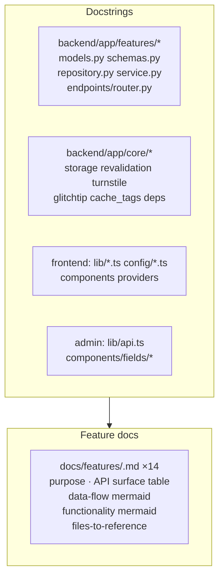
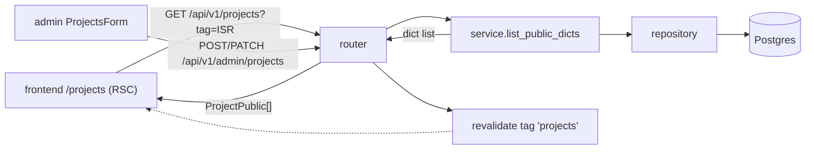

# S2_T07 — Docstrings (Public API Surface) + Per-Feature Documentation

| Field | Value |
|---|---|
| **Spec** | `S2_T07_20260822-2212_docstrings-feature-docs.md` |
| **Phase / Session** | S2 · Tasks 7a–7b (largest task; may spill into session 3) |
| **Executor** | agent (parallelizable by feature) |
| **Depends on** | S2_T02 (committed baseline; docs describe real code) |
| **Blocks** | nothing (independent); improves every later review |
| **Status** | ⏳ PENDING |

## Purpose
User requirement: every feature/function/file carries a docstring, and each feature has a markdown doc explaining purpose, data flow and functionality with mermaid diagrams. Scope decision (user-approved): **public API surface** — modules, classes, public functions/methods across backend features + frontend lib/config + admin shared components — not private helpers or tests.

## What to do

## Feature doc template (`docs/features/<name>.md`)
1. **Purpose** — what the feature is for, which audience tiles it feeds
2. **API surface** — endpoint table (method, path, auth, response model)
3. **Data flow** — mermaid `flowchart LR`: request → router → service(dict serialization) → repository → Postgres/R2 → response → frontend fetch/cache-tag → ISR page
4. **Functionality** — mermaid `flowchart TD` of key behaviours (publishing lifecycle, relevance resolution, anti-abuse chain…)
5. **Files to reference** — exact paths
6. **Invariants specific to this feature**

Example data-flow block (projects feature):

## Expected changes / where
- Docstring edits across ~60 backend files + ~15 frontend/admin files (docstrings only — **zero behaviour changes**, verified by unchanged test results)
- New `docs/features/` directory, one file per backend feature (14)

## Functionality & example
Docstring style follows existing repo pattern (see `backend/app/core/models.py` mixin docstrings): imperative summary line + design-rationale notes where non-obvious. Frontend example target: `frontend/lib/relevance.ts` gains a module doc explaining the parity contract with the backend resolver and pointing at the fixture test.

## Testing & acceptance criteria
- [ ] pytest/ruff/mypy/tsc all still green after docstring pass (proves zero behaviour drift)
- [ ] Every `backend/app/features/*/` module trio (service/repository/schemas/models/router) has module-level docstrings; public functions have arg/return descriptions where non-trivial
- [ ] 14 feature docs exist, each containing both mermaid diagrams and a files-to-reference table
- [ ] No comment noise on self-evident code (per repo style)

## References
Existing exemplar docstrings in `backend/app/core/models.py`, `backend/app/tests/helpers.py` · `docs/conventions.md` · post-development report architecture section

## Dependencies
None beyond committed baseline. Parallelizable: one agent slice per feature group (auth+relevance / content tracks / crawlers+forms / core+frontend).
