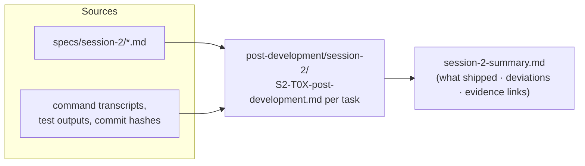

# S2_T08 — Post-Development Documentation (Session-2 Tasks)

| Field | Value |
|---|---|
| **Spec** | `S2_T08_20260822-2212_post-development-docs-session-1.md` |
| **Phase / Session** | S2 · Task 8 |
| **Executor** | agent |
| **Depends on** | each task's completion (rolling) |
| **Blocks** | S2_T09 handoff (links these) |
| **Status** | ⏳ PENDING (partially seeded: session-1 report already written in S2_T03) |

## Purpose
User requirement: every task developed gets post-development documentation under `docs/post-development/session-<n>/`, recording what was actually built versus planned, with the same rigour as the spec.

## What to do
Maintain one file per completed session-2 task plus a phase summary:



Files:
1. `gate-p2-evidence.md` (from S2_T04)
2. `ci-pipeline-post-development.md` (from S2_T05/T06: workflow inventory, run links, break-test results)
3. `docstrings-feature-docs-post-development.md` (from S2_T07: coverage stats, doc index)
4. `session-2-summary.md` — executive roll-up feeding the handoff

## Expected changes / where
Only additions under `docs/post-development/session-2/`. No code changes.

## Functionality & example
Each record answers five questions with evidence: what was planned (spec link), what was built, what deviated + why + who decided, how it was verified (exact commands/outputs), what remains. Example entry shape:

```markdown
## S2_T05 CI quality gates — Post-Development
- Built: .github/workflows/ci.yml (4 jobs) …
- Deviation: oxlint warnings tolerated at N because … (decision recorded)
- Verification: green run #<id> on main; deliberate-break test red run #<id>
- Remaining: tighten --max-warnings after TD-35 perf pass
```

## Testing & acceptance criteria
- [ ] Every `[x] Status` flip on a session-2 spec has a matching post-development record
- [ ] Each record contains at least one verifiable artifact link (commit hash, CI run URL, command transcript)
- [ ] `session-2-summary.md` exists before handoff is written

## References
`docs/post-development/session-1/post-development-report.md` (format exemplar) · specs in `docs/specs/session-2/`

## Dependencies
Rolling — grows as T04..T07 complete; finalized by T09.
