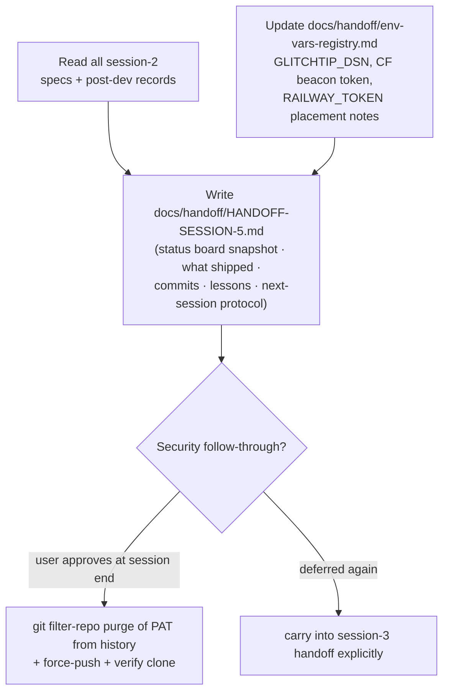

# S2_T09 — Session Handoff + Registry Updates

| Field | Value |
|---|---|
| **Spec** | `S2_T09_20260822-2212_handoff-session.md` |
| **Phase / Session** | S2 · Task 9 (final) |
| **Executor** | agent |
| **Depends on** | S2_T03..T08 all complete |
| **Blocks** | session 3 start (its first read) |
| **Status** | ⏳ PENDING |

## Purpose
Close the loop: the next session must resume with full context from one file, and every environment variable touched this session must be registered. Also carries the deferred security item.

## What to do

## Handoff content contract
1. Status of every pending row in the master board (TD-12..15, TD-M1..M6, TD-36)
2. What shipped this session with commit hashes
3. New decisions made (with rationale) that contradict or extend conventions
4. Lessons learned (only new ones; prior lists stay in prior handoffs)
5. Execution protocol for session 3: expected order = CI verification → paired manual infra → launch prep
6. Explicit carry-forward of the history-purge security item if still deferred

## Expected changes / where
- Create: `docs/handoff/HANDOFF-SESSION-5.md`
- Update: `docs/handoff/env-vars-registry.md`, `development_plan/todos/README.md` rows for completed session-2 tasks

## Functionality & example
Session 3 starts by reading exactly one file (`HANDOFF-SESSION-5.md`) whose §"Documents for next session" table points to everything else in priority order — same pattern as HANDOFF-SESSION-3/4, proven across two session transitions.

## Testing & acceptance criteria
- [ ] A reader with zero conversation context can execute session 3 from the handoff alone
- [ ] Env registry diff matches every new env var actually referenced in code/config this session
- [ ] Security item either executed with evidence or explicitly carried forward
- [ ] Final commit sequence clean; working tree green at session end

## References
`docs/handoff/HANDOFF-SESSION-3.md` §8-10 (format) · `docs/handoff/env-vars-registry.md` · user instruction "create a separate handoff directory"

## Dependencies
Strictly last within the session.
